* ### INNER JOIN : 공통 부분만 가져온다. → NULL X

  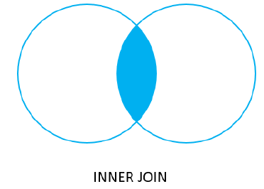

  * 예제 1 : BASKET_A와 BASKET_B 각각에서 공통 부분만 가져온다.

    ```sql
    SELECT * FROM BASKET_A
    SELECT * FROM BASKET_B
    ```

    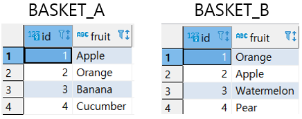

    ```SQL
    SELECT
    	A.ID AS ID_A,
    	A.FRUIT AS FRUIT_A,
    	B.ID AS ID_B,
    	B.FRUIT AS BRUIT_B
    FROM 
    	BASKET_A A
    INNER JOIN
    	BASKET_B B
    ON A.FRUIT = B.FRUIT
    ;
    ```

    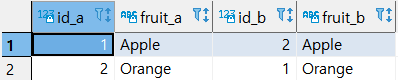

  * 예제 2 : 한명의 고객은 여러 건의 결제내역을 가질 수 있고, 하나의 결제는 반드시 고객을 가져야 하는 경우이다.

    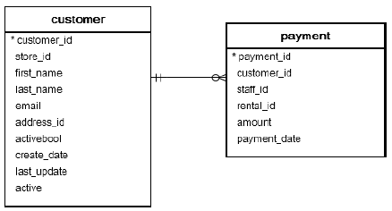

    ```SQL
    SELECT
    	A.CUSTOMER_ID, A.FIRST_NAME,
    	A.LAST_NAME, A.EMAIL,
    	B.AMOUNT, B.PAYMENT_DATE
    FROM CUSTOMER A
    INNER JOIN PAYMENT B
    ON A.CUSTOMER_ID = B.CUSTOMER_ID
    ;
    ```

    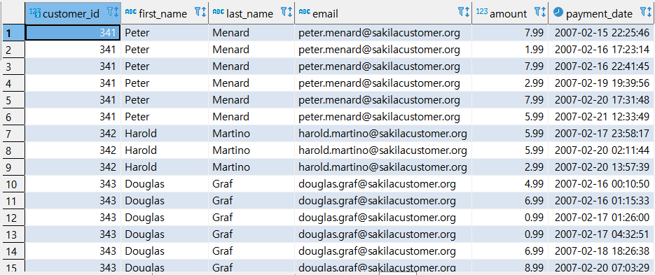

  * 예제3 : (1) 한 명이 직원은 여러 건의 결제내역을 처리하고, (2) 하나의 결제는 반드시 처리한 직원이 존재하고, (3)한 명의 고객은 여러 건의 결제내역을 가지고 (4) 하나의 결제는 반드시 고객을 가져야 하는 경우이다.

    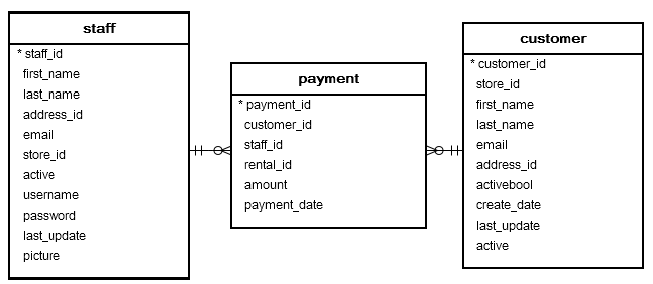

    ```SQL
    SELECT
    	C.CUSTOMER_ID, C.FIRST_NAME, C.LAST_NAME, C.EMAIL,
    	B.AMOUNT, B.PAYMENT_DATE,
    	C.FIRST_NAME AS S_FIRST_NAME,
    	C.LAST_NAME AS S_LAST_NAME
    FROM STAFF A
    INNER JOIN PAYMENT B
    ON A.STAFF_ID = B.STAFF_ID
    INNER JOIN CUSTOMER C
    ON B.CUSTOMER_ID = C.CUSTOMER_ID;
    ```

    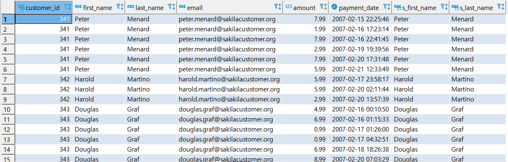

  

* ### LEFT OUTER JOIN :  왼쪽 정보를 다 가져오고 왼쪽에 있는 것만 가져다 붙인다.

  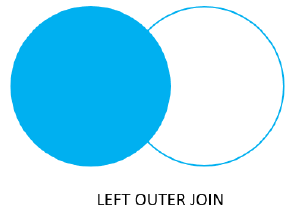

  * 예제 1 : BASKET_A 는 다 나오고 공통인것이 있으면 B는 옆에 나온다.

    ```SQL
    SELECT
    	A.ID AS ID_A,
    	A.FRUIT AS FRUIT_A,
    	B.ID AS ID_B,
    	B.FRUIT AS FRUIT_B
    FROM
    	BASKET_A A
    LEFT JOIN
    	BASKET_B B
    ON A.FRUIT = B.FRUIT;
    ```

    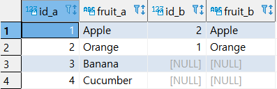

  * 예제 2 : LEFT ONLY 구문이다. (LEFT한테만 있는것!!!)

    ```SQL
    SELECT
    	A.ID AS ID_A,
    	A.FRUIT AS FRUIT_A,
    	B.ID AS ID_B,
    	B.FRUIT AS FRUIT_B
    FROM
    	BASKET_A A
    LEFT JOIN
    	BASKET_B B
    ON A.FRUIT = B.FRUIT;
    WHERE B.FRUIT IS NULL;
    ```

    

* ### RIGHT OUTER JOIN : 오른쪽 정보를 다 가져오고 왼쪽에 있는 것만 가져다 붙인다.

  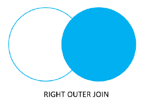

  * 예제 1 

    ```SQL
    SELECT 
    	A.ID AS ID_A,
    	A.FRUIT AS FRUIT_A,
    	B.ID AS ID_B,
    	B.FRUIT AS FRUIT_B
    FROM BASKET_A A         
    RIGHT JOIN BASKET_B B
    ON B.FRUIT = A.FRUIT;
    ```

    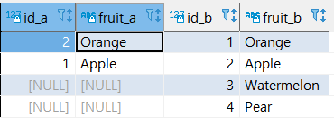

  * 예제 2 : RIGHT ONLY 구문이다. (RIGHT한테만 있는것!!!)

    ```SQL
    SELECT 
    	A.ID AS ID_A,
    	A.FRUIT AS FRUIT_A,
    	B.ID AS ID_B,
    	B.FRUIT AS FRUIT_B
    FROM BASKET_A A         
    RIGHT JOIN BASKET_B B
    ON B.FRUIT = A.FRUIT
    WHERE A.FRUIT IS NULL;
    ```

    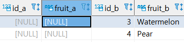

* ### SELF JOIN : 같은 TABLE 끼리 JOIN 하는것을 말한다.

  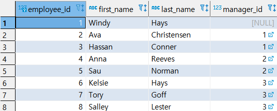

  * 예제 1 : SELF INNER JOIN

    ```SQL
    SELECT
    	E.FIRST_NAME || ' ' || E.LAST_NAME EMPLOYEE,
    	M.FIRST_NAME || ' ' || M.LAST_NAME MANAGER
    FROM 
    	EMPLOYEE E
    INNER JOIN EMPLOYEE M
    ON M.EMPLOYEE_ID = E.MANAGER_ID
    ORDER BY MANAGER;
    ```

    
    
    
    
  * 예제 2 : SELF LEFT OUTER JOIN
  
    ```SQL
    SELECT
    	E.FIRST_NAME || ' ' || E.LAST_NAME EMPLOYEE,
    	M.FIRST_NAME || ' ' || M.LAST_NAME MANAGER
    FROM 
    	EMPLOYEE E
    LEFT JOIN EMPLOYEE M
    ON M.EMPLOYEE_ID = E.MANAGER_ID
    ORDER BY MANAGER;
    ```
  
    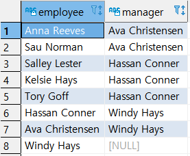

