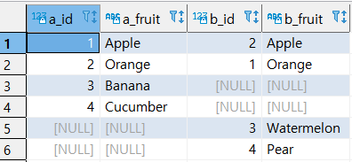
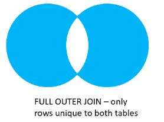
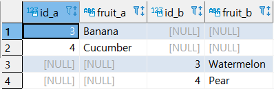
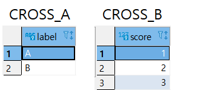
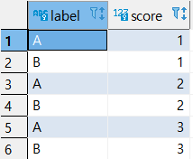

* ### FULL OUTER JOIN : INNER, LEFT OUTER, RIGHT OUTER JOIN을 모두 출력한다.

  * 예제 1 : 일반적인 FULL OUTER JOIN

    

    ```SQL
    SELECT 
    	A.ID AS A_ID,
        A.FRUIT AS A_FRUIT,
        B.ID AS B_ID,
        B.FRUIT AS B_FRUIT
    FROM BASKET_A A
    FULL OUTER JOIN BASKET_B B
    ON A.FRUIT = B.FRUIT
    ;
    ```

    

    

  * 예제 2 : ONLY OUTER JOIN

    

    ```sql
    SELECT
    	A.ID AS ID_A,
    	A.FRUIT AS FRUIT_A,
    	B.ID AS ID_B,
    	B.FRUIT AS FRUIT_B
    FROM BASKET_A A
    FULL OUTER JOIN BASKET_B B
    ON A.FRUIT = B.FRUIT
    WHERE A.ID IS NULL
    OR B.ID IS NULL
    ;
    ```

    

* #### CROSS JOIN : CATESIAN PRODUCT 연산의 결과를 출력한다.

  * 예제 1

    ```SQL
    SELECT * FROM CROSS_T1;
    SELECT * FROM CROSS_T2;
    ```

    

    ```SQL
    SELECT
    	A.LABEL, B.SCORE
    FROM CROSS_T1 A
    CROSS JOIN CROSS_T2 B
    ;
    ```

    

    

