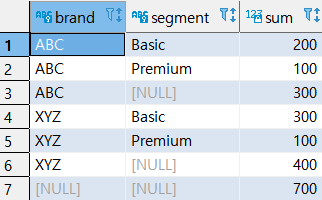

* ### GROUP BY

  * 예제 (1) : 고객 별 총 구매 금액

    ```SQL
    SELECT 
    	CUSTOMER_ID,
    	SUM(AMOUNT) AS AMOUNT_SUM
    FROM
    	PAYMENT
    GROUP BY CUSTOMER_ID
    ORDER BY SUM(AMOUNT) DESC
    ;
    ```

    

  * 예제 (2) : 직원 별 거래 횟수

    ```SQL
    SELECT 
    	STAFF_ID,
    	COUNT(PAYMENT_ID)
    FROM
    	PAYMENT
    GROUP BY CUSTOMER_ID
    ;
    ```

    


* ### HAVING 절

  * 예제 (1) :  고객 별 총 금액이 200 초과인 사람들

    ```SQL
    SELECT
    	CUSTOMER_ID,
    	SUM(AMOUNT)
    FROM 
    	PAYMENT
    GROUP BY
    	CUSTOMER_ID
    HAVING 
    	SUM(AMOUNT) > 200
    ;
    ```
    
    
    
  * 예제 (2)  : 거래 횟수가 300이 넘는 가게

    ```SQL
    SELECT
    	STORE_ID,
    	COUNT(CUSTOMER_ID) AS COUNT
    FROM 
    	CUSTOMER
    GROUP BY
    	STORE_ID
    HAVING COUNT(CUSTOMER_ID) > 300
    ;
    ```
    
    

  

* ### GROUPTING SET절 : 여러 GROUP BY 절의 UNION ALL을 해준다.

  * 예제 (1)

    ```SQL
    -- BRAND, SEGMENT에 의한 그룹핑
    (SELECT
    	BRAND,
    	SEGMENT,
    	SUM(QUANTITY)
    FROM
    	SALES
    GROUP BY BRAND, SEGMENT)
    UNION ALL
    -- BRAND에 의한 그룹핑
    (SELECT
    	BRAND,
     	NULL,
    	SUM(QUANTITY)
    FROM
    	SALES
    GROUP BY BRAND)
    UNION ALL
    -- SEGMENT에 의한 그룹핑
    (SELECT
    	NULL,
     	SEGMENT,
    	SUM(QUANTITY)
    FROM
    	SALES
    GROUP BY SEGMENT)
    UNION ALL
    -- SUM 
    (SELECT
    	NULL,
     	NULL,
    	SUM(QUANTITY)
    FROM
    	SALES)
    ;
    ```
    
    
    
    위의 SELECT문을 다음과 같이 사용할 수 있다.
    
    ```SQL
    SELECT BRAND,
    	   SEGMENT,
    	   SUM(QUANTITY)
    FROM SALES
    GROUP BY
    GROUPING SETS(
    (BRAND, SEGMENT),
    (BRAND),
    (SEGMENT),
    ()    
    );
    ```
    
  * 예제 (2)  : `GROUPING ` 함수를 활용한다. `GROUPING` 함수는 해당 컬럼이 집계에 사용됐으면 0, 그렇지 않으면 1을 출력한다.
  
    ```SQL
    SELECT
    	GROUPING(BRAND) AS GROUPING_BRAND,
    	GROUPING(SEGMENT) AS GROUPING_SEGMENT,
    	BRAND,
    	SEGMENT,
    	SUM(QUANTITY)
    FROM
    	SALES
    GROUP BY GROUPING SETS(
    	(BRAND, SEGMENT),
        (BRAND),
        (SEGMENT),
        ()
    )
    ORDER BY BRAND, SEGMENT
    ;
    ```
  
    
  
  

* #### ROLL UP :  GROUP BY 뒤에 바로 적으며 다양한 소계를 출력한다.

  * 예제 (1) 

    ```SQL
    SELECT
    	BRAND,
    	SEGMENT,
    	SUM(QUANTITY)
    FROM 
    	SALES
    GROUP BY
    	ROLLUP(BRAND, SEGMENT)
    ORDER BY
    	BRAND, SEGMENT;
    ```

    

    * BRAND, SEGMENT 컬럼 기준 합계
    * BRAND, SEGMENT 컬럼 기준 합계
    * BRAND 컬럼 기준 합계
    * BRAND, SEGMENT 컬럼 기준 합계
    * BRAND, SEGMENT 컬럼 기준 합계
    * BRAND
    * 전체 합계를 구한다.

  * 예제 (2) : 

    ```SQL
    SELECT
    	SEGMENT,
    	BRAND,
    	SUM(QUANTITY)
    FROM
    	SALES
    GROUP BY SEGMENT, ROLLUP(BRAND)
    ORDER BY SEGMENT, BRAND;
    ```

    

    *  SEGMENT, BRAND 컬럼 기준 합계
    *  SEGMENT, BRAND 컬럼 기준 합계
    *  SEGMENT 컬럼 기준 합계
    *  SEGMENT, BRAND 컬럼 기준 합계
    *  SEGMENT, BRAND 컬럼 기준 합계


* CUBE : `GROUPING SETS` 의 모든 경우를 나타낸다.

  


