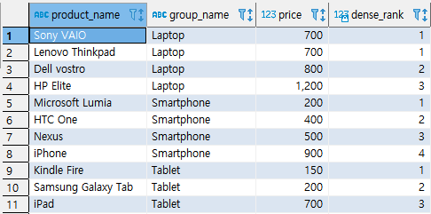
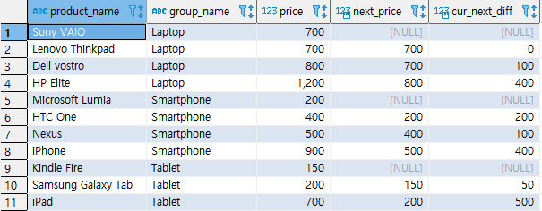

## 분석함수

> 특정 집합 내에서 겨로가 건수의 변화 없이 해당 집합안에서 합계 및 카운트 등을 계산할수 있는 함수이다.


* ###  AVG

  * 예제(1) : 전체 평균 구하기

    ```sql
    SELECT * FROM PRODUCT;
    ```

    

    ```SQL
    SELECT AVG(PRICE) FROM PRODUCT;
    ```

    

  * 예제(2) : GROUP BY + AVG 구하기

    ```SQL
    SELECT * FROM PRODUCT_GROUP;
    ```

    

    ```SQL
    SELECT B.GROUP_NAME, AVG(PRICE)
    from PRODUCT A
    INNER JOIN PRODUCT_GROUP B
    	ON (A.GROUP_ID = B.GROUP_ID);
    ```

    

    ```SQL
    SELECT B.GROUP_NAME, AVG(A.PRICE)
    from PRODUCT A
    INNER JOIN PRODUCT_GROUP B
    	ON (A.GROUP_ID = B.GROUP_ID)
    GROUP BY GROUP_NAME;
    ```

    

  * 예제(3) : 분석함수 사용

    ```SQL
    SELECT 
    	A.PRODUCT_NAME,
    	A.PRICE,
    	B.GROUP_NAME,
    	AVG(PRICE) OVER (PARTITION BY B.GROUP_NAME)
    FROM PRODUCT A
    INNER JOIN PRODUCT_GROUP B
    ON (A.GROUP_ID = B.GROUP_ID);
    ```

    * LAST_VALUE함수에는 DEFAULT가 `RANGE BETWEEN UNBOUNDED PRECEDING AND CURRENT AND CURRENT ROW`이다.

    


* ROW_NUMBER, RANK, DENSE_RANK

  * 예제(1) : ROW_RANK는 무조건 1, 2, 3, 4, 5 로 매긴다.

    ```SQL
    SELECT
    	A.PRODUCT_NAME,
    	B.GROUP_NAME,
    	A.PRICE,
    	ROW_NUMBER() OVER (PARTITION BY GROUP_NAME ORDER BY A.PRICE)
    FROM PRODUCT A
    INNER JOIN PRODUCT_GROUP B
    ON (A.GROUP_ID = B.GROUP_ID);
    ```

    

  * 예제(2) : RANK는 같은 조건이면 같은 순위이며 다음 순위로 건너뛴다. 예를 들어, 1, 1, 3, 4, ...

    ```SQL
    SELECT
    	A.PRODUCT_NAME,
    	B.GROUP_NAME,
    	A.PRICE,
    	RANK() OVER (PARTITION BY GROUP_NAME ORDER BY A.PRICE)
    FROM PRODUCT A
    INNER JOIN PRODUCT_GROUP B
    ON (A.GROUP_ID = B.GROUP_ID);
    ```

    

  * 예제(3) : DENSE_RANK 는 같은 조건이면 같은 순위이며 다음 순위로 건너뛰지 않는다. 예를 들어, 1, 1, 2, 3, ...

    ```SQL
    SELECT
    	A.PRODUCT_NAME,
    	B.GROUP_NAME,
    	A.PRICE,
    	DENSE_RANK() OVER (PARTITION BY GROUP_NAME ORDER BY A.PRICE)
    FROM PRODUCT A
    INNER JOIN PRODUCT_GROUP B
    ON (A.GROUP_ID = B.GROUP_ID);
    ```

    


* FIRST_VALUE, LAST_VALUE

  * 예제(1) : `FIRST_VALUE`는 해당 집합안에서 특정 컬럼의 첫번째 값을 구하는 함수이다.

    ```SQL
    SELECT 
    	A.PRODUCT_NAME, B.GROUP_NAME, A.PRICE,
    	FIRST_VALUE(PRICE) OVER (PARTITION BY GROUP_NAME ORDER BY A.PRICE)
    	AS LOWEST_PRICE_PER_GROUP
    FROM PRODUCT A
    INNER JOIN PRODUCT_GROUP B
    ON (A.GROUP_ID = B.GROUP_ID);
    ```

    

  * 예제(2) : `LAST_VALUE` 특정 컬럼의 마지막 값을 구하는 함수이다.

    ```SQL
    SELECT 
    	A.PRODUCT_NAME, B.GROUP_NAME, A.PRICE,
    	LAST_VALUE(PRICE) OVER (PARTITION BY GROUP_NAME ORDER BY A.PRICE RANGE BETWEEN UNBOUNDED PRECEDING AND UNBOUNDED FOLLOWING) AS HIGHEST_PRICE_PER_GROUP
    FROM PRODUCT A
    INNER JOIN PRODUCT_GROUP B
    ON (A.GROUP_ID = B.GROUP_ID);
    ```

    

    


* LAG, LEAD

  * 예제(1) : `LEAD`는 다음 행의 값을 출력한다.

    ```SQL
    SELECT 
    	A.PRODUCT_NAME, B.GROUP_NAME, A.PRICE,
    	LEAD(A.PRICE, 1) OVER (PARTITION BY B.GROUP_NAME ORDER BY PRICE) AS NEXT_PRICE,
    	A.PRICE-LEAD(A.PRICE, 1) OVER (PARTITION BY B.GROUP_NAME ORDER BY PRICE) AS CUR_NEXT_DIFF
    FROM PRODUCT A
    INNER JOIN PRODUCT_GROUP B
    ON (A.GROUP_ID = B.GROUP_ID);
    ```

    

  * 예제(2) : `LAG`는 이전 행의 값을 찾는다.

    ```SQL
    SELECT 
    	A.PRODUCT_NAME, B.GROUP_NAME, A.PRICE,
    	LAG(A.PRICE, 1) OVER (PARTITION BY B.GROUP_NAME ORDER BY PRICE) AS NEXT_PRICE,
    	A.PRICE-LAG(A.PRICE, 1) OVER (PARTITION BY B.GROUP_NAME ORDER BY PRICE) AS CUR_NEXT_DIFF
    FROM PRODUCT A
    INNER JOIN PRODUCT_GROUP B
    ON (A.GROUP_ID = B.GROUP_ID);
    ```

    

