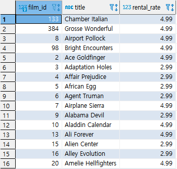
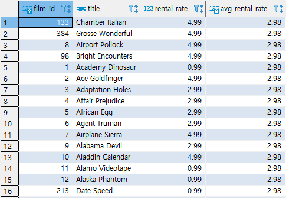
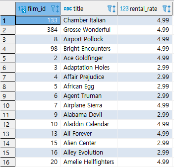

## 서브쿼리(1)

> 서브쿼리를 활용해 다양한 결과를 도출할 수 있다. 서브쿼리는 `중첩 서브쿼리`, `인라인 뷰`, `스칼라` `서브쿼리`가 존재한다.


* ### 중첩 서브쿼리(WHERE절에 있는 서브쿼리)

  * 예제(1) : RENTAL_RATE가 평균보다 큰 집합을 추출한다.

    ```SQL
    SELECT 
    	A.FILM_ID,
    	A.TITLE,
    	A.RENTAL_RATE
    FROM 
    	FILM A
    WHERE A.RENTAL_RATE > 
    	(SELECT AVG(RENTAL_RATE)
                        FROM FILM);
    ```
    
    


* ### 인라인 뷰(FROM절에 있는 서브쿼리)

  * 예제(1) : RENTAL_RATE가 평균보다 큰 집합을 추출한다.
  
    ```SQL
    SELECT
    	A.FILM_ID,
    	A.TITLE,
    	A.RENTAL_RATE
    FROM FILM A,
    	 (SELECT AVG(RENTAL_RATE) AS AVG_RENTAL_RATE FROM FILM) B
    WHERE A.RENTAL_RATE > B.AVG_RENTAL_RATE;
    ```
  
    


* ### 스칼라 서브쿼리(SELECT문에 있는 서브쿼리)

  * 예제(1) : RENTAL_RATE가 평균보다 큰 집합을 추출한다. 

    * 1단계 : 스칼라 서브쿼리를 사용한다.

      ```SQL
      SELECT
      	A.FILM_ID,
      	A.TITLE,
      	A.RENTAL_RATE,
      	(SELECT AVG(RENTAL_RATE) AS AVG_RENTAL_RATE FROM FILM) 
      FROM FILM A
      ```

      

    * 2단계 위에서 만든 집합을 FROM절에 다시 넣어준다.

      ```SQL
      SELECT
      	A.FILM_ID,
      	A.TITLE,
      	A.RENTAL_RATE
      FROM 
      (
      SELECT
      	A.FILM_ID,
      	A.TITLE,
      	A.RENTAL_RATE,
      	(SELECT AVG(RENTAL_RATE) AS AVG_RENTAL_RATE FROM FILM) 
      FROM FILM A
      ) A
      WHERE A.RENTAL_RATE > A.AVG_RENTAL_RATE;
      ```

      

    

  * 

