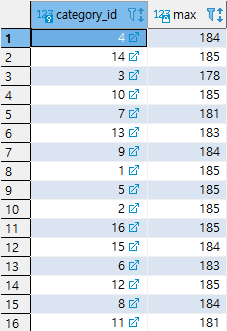
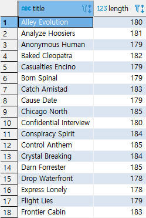
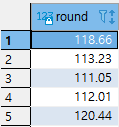
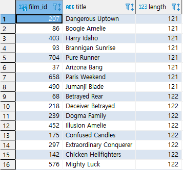
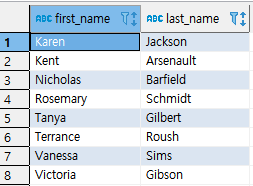

## 서브쿼리(2)

> ANY, ALL, EXISTS 연산자를 활용한 서브쿼리에 대해 알아본다.


* ### ANY 연산자

  * 예제(1)

    * 1단계 : Category 별로 LENGTH 최댓값을 가져온다.

      ```SQL
      SELECT
      	CATEGORY_ID, MAX(LENGTH)
      FROM FILM A,
      	 FILM_CATEGORY B
      WHERE A.FILM_ID = B.FILM_ID
      GROUP BY CATEGORY_ID;
      ```

      

    * 2 단계 : 위에서 뽑은 max 값들 보다 어느 하나라도 크거나 같으면 선택된다.

      ```SQL
      SELECT
      	TITLE, LENGTH
      FROM 
      	FILM
      WHERE LENGTH >= ANY
      (
      SELECT
      	 MAX(LENGTH)
      FROM FILM A,
      	 FILM_CATEGORY B
      WHERE A.FILM_ID = B.FILM_ID
      GROUP BY CATEGORY_ID
      );
      ```

       

  

* ### ANY 연산자

  * 예제(1)

    * 1단계 : 평가기준 별 평균 길이를 계산한다.

      ```SQL
      SELECT 
      	ROUNT(AVG(LENGTH), 2)
      FROM 
      	FILM
      GROUP BY RATING;
      ```

      

    * 2단계 : 평가기준 별 모든 평균보다 큰 영화들을 추출한다.

      ```SQL
      SELECT
      	FILM_ID, TITLE, LENGTH
      FROM FILM
      WHERE LENGTH > ALL
      (
      SELECT 
      	ROUND(AVG(LENGTH), 2)
      FROM 
      	FILM
      GROUP BY RATING
      )
      ORDER BY LENGTH;	
      ```

      


* ### EXSITS 연산자 : 서브쿼리 내에 집합이 존재하는지 존재 여부만 판단한다. 존재 여부만을 판단하므로 연산 시 부하가 줄어든다.

  * 예제(1)

    ```SQL
    SELECT
    	FIRST_NAME, LAST_NAME
    FROM CUSTOMER C
    WHERE EXISTS
    (
    SELECT 1
    FROM PAYMENT P
    WHERE P.CUSTOMER_ID = C.CUSTOMER_ID
        AND P.AMOUNT > 11
    )
    ORDER BY FIRST_NAME, LAST_NAME;
    ```

    

  

