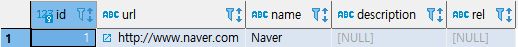
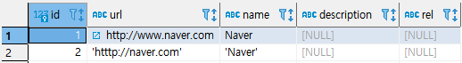
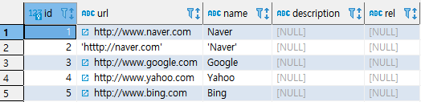
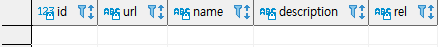
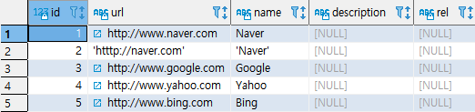

## INSERT

> 테이블이 만들어지면 빈 공간이 만들어 지는 것이며  테이블 안에 데이터를 INSERT하는 것이 필요하다.


* ###  INSERT 문법

  * 테이블의 컬럼 순서대로 입력

    ```SQL
    INSERT
    	INTO TABLE_NAME
    VALUES
    (
    	VALUE1,
        VALUE2,
        ...
    );
    ```

  * 테이블 컬럼을 지정

    ```SQL
    INSERT
    	INTO TABLE_NAME
    (
    COLUMN1,
    COLUMN2
    )
    VALUES
    (
    VALUE1,
    VALUE2
    );
    ```

  

* ### 실습

  * 예제(1) : 일반적인 INSERT

    ```SQL
    CREATE TABLE LINK
    (
    	ID SERIAL PRIMARY KEY,
    	URL VARCHAR (255) NOT NULL,
        NAME VARCHAR (255) NOT NULL,
        DESCRIPTION VARCHAR (255),
        REL VARCHAR (50)
    );
    ```

    ```sql
    INSERT
    	INTO LINK
    (URL, NAME)
    VALUES 
    ('http://www.naver.com','Naver')
    ;
    COMMIT;
    SELECT *  FROM LINK;
    ```

    

  * 예제(2) : 작은 따옴표 자체를 데이터로 입력

    ```SQL
    INSERT
    	INTO LINK
    (URL, NAME)
    VALUES
    ('''htttp://naver.com''', '''Naver''');
    COMMIT;
    SELECT *  FROM LINK;
    ```

    

  * 예제(3) : 동시에 N개 ROW 입력

    ```SQL
    INSERT
    	INTO LINK
    (URL, NAME)
    VALUES
    	('http://www.google.com', 'Google'),
    	('http://www.yahoo.com', 'Yahoo'),
    	('http://www.bing.com', 'Bing')
    ;
    COMMIT;
    SELECT *  FROM LINK;
    ```

    

  * 예제(4) : 테이블을 테이블에 입력

    ```SQL
    CREATE TABLE LINK_TMP AS
    SELECT * FROM LINK WHERE 1=0;
    
    SELECT  * FROM LINK_TMP;
    ```

    

    ```SQL
    INSERT
    	INTO LINK_TMP
    SELECT * FROM LINK;
    COMMIT;
    
    SELECT * FROM LINK_TMP;
    ```

    

