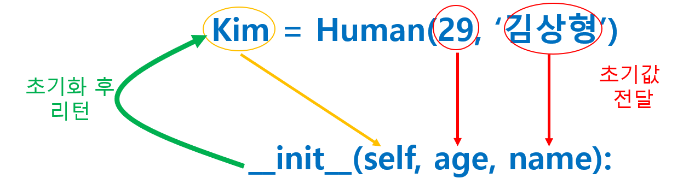

# 클래스

> 개념보다 사용법 위주로 요약해본다.


## 정의

> 클래스 관련 정의를 정리한다.


* 클래스 : 관련된 속성과 동작을 하나의 범주로 묶어 실세계의 사물을 흉내 낸다.
* 모델링:  사물을 분석하여 필요한 속성과 동작을 추출하는 것이다.
* 캡슐화 : 모델링된 결과를 클래스로 포장하는 것이다.

* 멤버 : 클래스를 구성하는 변수와 함수를 합쳐 멤버라고 통칭한다.

* 인스턴스 : 클래스로부터 생성된 각각의 객체

## 캡슐화

> 긴밀하게 연관된 정보는 모여 있어야 안벽하게 동작하며 하나의 범주로 묶어야 관리하기 편하다.


* 장점 : 매번 속성과 동작을 새로 만들어야 하는 낭비가 있는데 캡슐화 해두면 객체만 만들면 된다.

    

* 예제

    ```python
    class Account:

        def __init__(self, balance):
            self.balance = balance

        def deposit(self, money):
            self.balance += money

        def inquire(self):
            print(f'잔액은 {self.balance}원입니다.')
    

    sinhan = Account(8000)
    sinhan.deposit(1000)
    sinhan.inquire()
    
    nonghyup = Account(1200000)
    nonghyup.inquire()
    
    # -------- 결과 --------
    # 잔액은 9000원입니다.
    # 잔액은 1200000원입니다.
    ```


## 생성자

> class 선언문에서 통상 객체를 초기화하는것이 `__init__` 생성자이다.


* 구조

  ```python
  class 이름:
      
      def __init__(self, 초기값):
          멤버 초기화
      
      메소드 정의
  ```

  * `self`는 키워드가 아니어서 아무 이름이나 쓸 수 있지만 `self`라는 명칭을 쓰는것이 관행이다.

  * self.멤버 = 초깃값 형식으로 대입한다.
  * 생성자 외에 더 필요한 method는 이 아래에 정의한다.


* 예제

  ```python
  class Human:
      def __init__(self, age, name):
          self.age = age
          self.name= name
  
      def intro(self):
          print(f'{self.age}살 {self.name}입니다.')
  
  
  kim = Human(29, '김상형')
  kim.intro()
  
  lee = Human(45, '이승우')
  lee.intro()
  
  # -------- 결과 --------
  # 29살 김상형입니다.
  # 45살 이승우입니다.
  ```




## 상속

> 기존 클래스를 `확장`하여 멤버를 추가하거나 동작을 변경하는 방법이다.


* 구조 : 클래스 이름 다음의 괄호 안에 부모 클래스의 이름을 지정한다.

  ```python
  class 이름(부모):
      ...
  ```


* 예제1 : `object`는 python에 있는 최상위 class이다. 모든 class는 object class이다.

  ```python
  class Human(object):
      def __init__(self, age, name):
          self.age = age
          self.name= name
  
      def intro(self):
          print(f'{self.age}살 {self.name}입니다.')
  
  ```


* 예제2 : `super()`를 이용해 부모 class의 method와 속성을 가져올 수 있다.

  ```python
  class Human:
  
      def __init__(self, age, name):
          self.age = age
          self.name= name
  
      def intro(self):
          print(f'{self.age}살 {self.name}입니다.')
  
  
  class Student(Human):
  
      def __init__(self, age, name, stunum):
          super().__init__(age, name)         # super() 대신 super(Human, self) 로 쓸 수 있다.
          self.stunum = stunum
  
      def intro(self):                        # 재정의(Override)
          super().intro()
          print(f'학번 : {self.stunum}')
  
      def study(self):
          print('2 + 3 = 5')
  
  
  lee = Student(34, '이승우', 930011)
  lee.intro()
  # 34살 이승우입니다.
  # 학번 : 930011
  lee.study()
  # 2 + 3 =5
  ```

  

## 액세서

> 파이썬은 공식적으로 정보 은닉을 지원하지 않는다. 따라서 파이썬 클래스의 멤버는 모두 공개되어 있으며 외부에서 누구나 엑세스 가능하다. 따라서 일정한 규칙을 만들어 두고 안전하게 액세스해야 한다.


* `Getter` method 와 `Setter` method를 정의하는게 보편적이다.

  ```python
  class Date:
  
      def __init__(self, month):
          self.month = month
  
      def getmonth(self):
          return self.month
  
      def setmonth(self, month):
          if 1 <= month <= 12 :
              self.month = month
  
  today = Date(8)
  today.setmonth(15)
  print(today.getmonth())   # 8
  ```

  * 그러나 이 코드는 `today.month = 123`이라고 대입하면 방어할 방법이 없다.


* 조금 더 안전한 방법 : member의 이름을 어렵게 만들고 `Getter`, `Setter`를 정의하고 프로퍼티를 정의한다. 

  ```python
  class Date:
  
      def __init__(self, month):
          self.inner_month = month
  
      def getmonth(self):
          return self.inner_month
  
      def setmonth(self, month):
          if 1 <= month <= 12 :
              self.inner_month = month
      month = property(getmonth, setmonth)
  
  today = Date(8)
  today.month =15
  print(today.getmonth())   # 8
  ```

  * `property`는 첫번째 인자로 `Gettet`를, 두번째 인자로 `Setter`를 넘겨주면 `month`라는 필드명을 이용해 다시 `month` 데이터에 접근할 수 있다.


* `decorator`를 활용한 `property`

  ```python
  class Date:
  
      def __init__(self, month):
          self.inner_month = month
      
      @property
      def month(self):             # getter
          return self.inner_month
      
      @month.setter
      def month(self):             # setter
          if 1 <= month <= 12:
              self.inner_month = month
  
  today = Date(8)
  today.month = 15
  print(today.month)       # 8
  ```

  * property를 쓰더라도 숨겨진 멤버의 이름을 알고 있다면 `today.inner_month = 15`는 여전히 막을 수 없다.

* 멤버 앞 `__` 붙이기 : `__`로 시작하면 이 멤버를 바로 참조하지 못한다. 

  ```python
  class Date:
  
      def __init__(self, month):
          self.__month = month
      def getmonth(self):
          return self.__month
      def setmonth(self, month):
          if 1 <= month <= 12:
              self.__month = month
      month = property(getmonth, setmonth)
  
  today = Date(8)
  
  today.__month = 15
  today.month = 15
  print(today.month)    # 8
  ```

  * `today.__month = 15` 또는 `todya.month = 15` 를 해도 값이 변경되지 않는다.

  * `__` 를 붙이면 내부적으로 `_클래스명__멤버명` 으로 속성이 숨겨진다. 여기서는 `today._Date__month = 15`를 입력하면 값이 변경된다.

## 참고

* 객체가 소멸될 때 자동으로 호출되는`__del__` 파괴자도 있으나 파이썬 메모르 관리가 자동화되어 있어 잘 사용하지 않는다.

