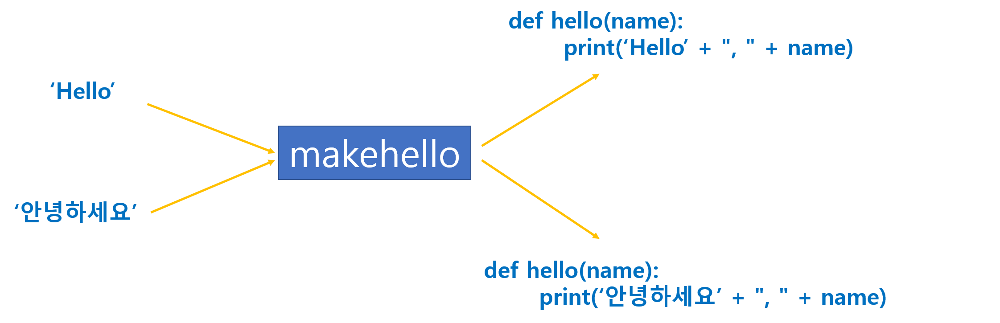

# 데코레이터

> 데코레이터 관해 정리한다.


## 일급 시민

>  전통적인 언어에서는 함수와 변수는 다르게 취급하지만 파이썬을 포함한 함수형 언어는 함수도 변수와 똑같은 방식으로 다룬다.


* 다음의 특성을 지닌 것을 **일급** **시민**(First Class Citizen)이라고 부른다. 여기서 시민이란 프로그래밍을 구성하는 객체를 말하며 일급은 모든 권리를 뜻한다.
  * 이름을 가진다.
  * 변수에 대입할 수 있다.
  * 인수로 전달할 수 있다.
  * 리턴할 수 있다.
  * 컬렉션에 저장할 수 있다.


* 예제 1 : 변수에 대입

  ```python
  def add(a, b):
      print(a + b)
      
  plus = add  # 변수에 대입
  plus(2, 3)  # 5
  ```

  

* 예제 2 : 인수로 넘기기

  ```python
  def calc(op, a, b):
      op(a,b)
  
  def add(a, b):
      print(a+b)
  
  def multi(a, b):
      print(a*b)
  
  calc(add, 3, 5)
  calc(multi, 3, 5)
  ```

  

## 지역 함수

> 지역 함수는 다른 함수 안에 정의되는 도우미 함수이다.


* 예제1 : `add` 함수는 지역 함수이기 때문에 외부에서 호출할 수 없다.

  ```python
  def calcsum(n):
      def add(a, b):
          return a + b
  
      sum = 0
      for i in range(1, n+1):
          sum = add(sum, i)
  
      return sum
  
  print('1~10 =', calcsum(10))
  ```

  * `add` 함수를 `calcsum` 함수 외부에 두면 평등한 관계로 작성해도 문제없다. 하지만 `calcsum`이 `add`에 종속되어 재사용이 번거롭다. (다른곳에서 `calcsum`을 사용할 때 `add`도 함께 있어야 하기 때문)

  * 자바 또는 C는 지역함수를 지원하지 않는 고급 문법이다.


* 예제2 : 

  ```PYTHON
  def makehello(message):
      def hello(name):
          print(message + ", " + name)
      return hello
  
  
  enghello = makehello('Hello')
  print(enghello)
  # <function makehello.<locals>.hello at 0x0000019B47C2D1F8>
  
  enghello('Mr kim')
  # Hello, Mr kim
  
  korhello = makehello('안녕하세요')('홍길동')
  # 안녕하세요, 홍길동
  ```

  * `enghello`, `korhello` 등의 변수에 `hello`가 변수에 대입되어 메모리에 계속 유지된다.
  * 함수가 함수를 실시간으로 만들어 낸다.
  * 원칙적으로 `message`인수는 지역 변수이기 때문에 함수가 리턴하면 사라져야 하지만 이 경우에는 예외가 적용된다. Closure 라는 특수한 구조를 만들어 계속 유지한다.




## 함수 데코레이터

> 함수에 장식을 붙이듯 앞뒤로 원하는 코드를 추가하는 기법이다. 


* 가장 쉬운 방법은 이 함수를 감싸는 것이다. 

  

