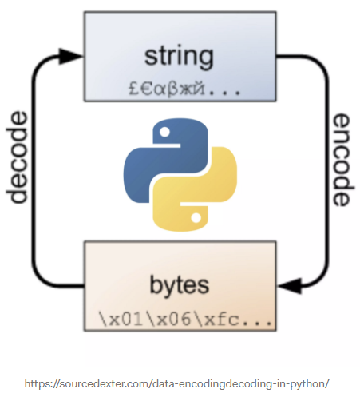

# 인코딩과 디코딩

> 파이썬에서 나오는 용어의 인코딩, 디코딩을 정리합니다.

## 글자를 표현 하는 방법

* ASCII : 아스키 코드, 영문 **알파벳**을 사용하는 7비트 문자 인코딩.  7비트→128개 문자 표현 가능

* CP949 : 코드 페이지 949,  MS사의 기본 코드 페이지로, 한글 인코딩의 한 종류이다.
* UTF-8 : 유니코드 인코딩, 가장 많이 사용되는 가변 길이 유니코드 인코딩이다.

## 인코딩

> `문자열`을 `바이트코드`로 변환한다. 

* encoing = 암호화 = 코드화 이다. 

* 

