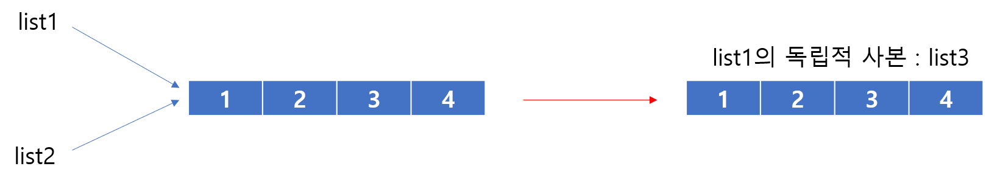
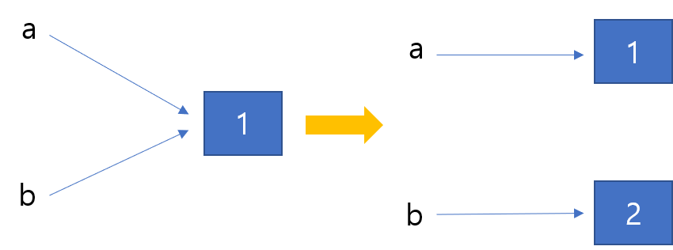

# i s 연산자

> `==` 와 마찬가지로 비교 연산자 이지만 `is`는 reference를 보고 비교한다.


* `copy`를 사용해 비교

	```python
list1 = [1, 2, 3, 4]
	list2 = list1
	list3 = list1.copy()
	print(f'id of list1 : {id(list1)}') # id of list1 : 2420810797448
	print(f'id of list2 : {id(list2)}') # id of list2 : 2420810797448
	print(f'id of list3 : {id(list3)}') # id of list3 : 2420810797960
	
	print('list1과 list2는 같다.' if list1 is list2 else 'list1과 list2는 다르다.')
	# list1과 list2는 같다.
	
	print('list2와 list3는 같다.' if list2 is list3 else 'list2과 list3는 다르다.')
	# list2과 list3는 다르다.
	
	print('list3과 list1는 같다.' if list3 is list1 else 'list3과 list1는 다르다.')
	# list3과 list1는 다르다.
	```




* `int` 객체

  ```python
  a = 1
  b = a
  print(f'a={a}, b={b}  :', a is b)  # a=1, b=1  : True
  
  b = 2
  print(f'a={a}, b={b}  :', a is b) # a=1, b=2  : False
  ```

  