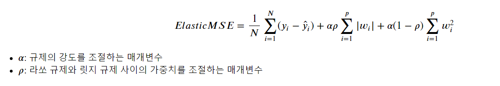
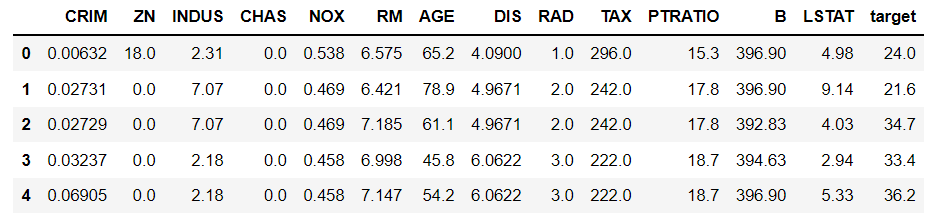

## ElasticNet

> Ridge regression과 Lasso regression의 하이브리드 형태인 Elastic Net에 대해 알아본다.


### 수식




### 간단한 예제

> GridSearch 방법을 통해 Elastic-Net으로 예제를 풀어본다.


* library

  ```python
  import pandas as pd
  import numpy as np
  import seaborn as sns
  from sklearn.datasets import load_boston
  
  from sklearn.linear_model import ElasticNet
  from sklearn.pipeline import make_pipeline
  from sklearn.preprocessing import StandardScaler
  from sklearn.model_selection import train_test_split
  
  import matplotlib.pyplot as plt
  import matplotlib
  matplotlib.rcParams['font.family']='Malgun Gothic'
  matplotlib.rcParams['axes.unicode_minus'] = False
  
  import warnings
  warnings.simplefilter('ignore')
  ```

* data

  ```python
  boston = load_boston()
  
  df = pd.DataFrame(boston['data'], columns=boston.feature_names)
  df['target'] = boston.target
  ```

  

* model 생성 및 학습

  ```python
  model_elasticnet = Pipeline([('scl', StandardScaler()), ('clf', ElasticNet())])
  param_value = {'clf__alpha':[0.001, 0.01, 1, 2, 3, 4, 10, 100],'clf__l1_ratio':[0, 0.25, 0.5, 0.75, 1] }
  gridSearch = GridSearchCV(model_elasticnet, param_grid=param_value, cv=5, verbose=1, scoring='r2')
  gridSearch.fit(x_train, y_train)
  ```

  ```python
  ## ------ 결과 ------
  Fitting 5 folds for each of 40 candidates, totalling 200 fits
  GridSearchCV(cv=5,
               estimator=Pipeline(steps=[('scl', StandardScaler()),
                                         ('clf', ElasticNet())]),
               param_grid={'clf__alpha': [0.001, 0.01, 1, 2, 3, 4, 10, 100],
                           'clf__l1_ratio': [0, 0.25, 0.5, 0.75, 1]},
               scoring='r2', verbose=1)
  ```

* best score 및 parameter

  ```python
  gridSearch.best_score_  # 0.7028557373608124
  gridSearch.best_params_ # {'clf__alpha': 0.01, 'clf__l1_ratio': 1}
  ```

* 결과

  ```python
  gridSearch.best_estimator_.score(x_test, y_test)
  # 0.7631190215910009
  ```

  

