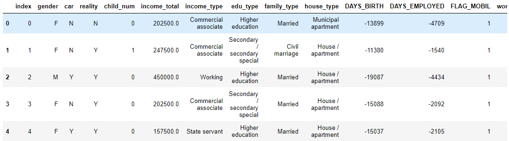
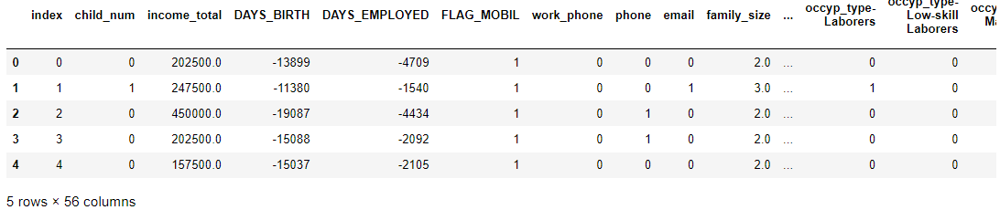

## KFold, StratifiedKFold

> `sklearn`의 `model_selection`에 있는 `KFold` 함수에 대해 알아본다.  `StratifiedKFold`의 경우 사용법은 `KFold` 와 같고 target class를 train/validation을 균등하게 분배해준다.


* ### library import

  ```python
  import os
  import warnings
  warnings.filterwarnings("ignore")
  
  import numpy as np
  import pandas as pd
  
  from sklearn.metrics import log_loss
  from sklearn.ensemble import RandomForestClassifier
  from sklearn.model_selection import KFold # k-fold 함수 import
  ```

  

* ### data

  * 데이터 불러오기

    ```python
    BASE_DIR = './data' 
    
    train_path = os.path.join(BASE_DIR, 'train.csv')
    data = pd.read_csv(train_path) 
    
    y_data = data['credit']
    data.drop(['credit'], axis=1, inplace=True)
    ```

    

  * 범주형 컬럼명 지정

    ```python
    cat_cols = [c for c, d in zip(data.columns, data.dtypes) if d=='O']
    print(cat_cols)
    # ['gender', 'car', 'reality', 'income_type', 'edu_type', 'family_type', 'house_type', 'occyp_type']
    ```

  * 데이터 처리

    ```python
    data_trans = pd.get_dummies(data, columns=cat_cols, prefix_sep='-')
    data_trans.head()
    ```

    

* ### KFold

  * 인수 살펴보기

    * n_splits : (적어도 2 이상) k-fold 의 k 지정이다.
    * shuffle(bool) : 섞기
    * random_state

  * KFold 객체 만들기

    ```python
    kf = KFold(n_splits=5, shuffle=True, random_state=42)
    ```

  * `split` method으로 data index 분할

    ```python
    list(kf.split(data_trans))
    ## 결과
    [(array([    0,     1,     2, ..., 26454, 26455, 26456]),
      array([    6,    17,    29, ..., 26440, 26442, 26443])),
     (array([    1,     2,     4, ..., 26452, 26453, 26455]),
      array([    0,     3,    19, ..., 26441, 26454, 26456])),
     (array([    0,     1,     2, ..., 26454, 26455, 26456]),
      array([    4,     5,     8, ..., 26449, 26450, 26451])),
     (array([    0,     3,     4, ..., 26454, 26455, 26456]),
      array([    1,     2,     7, ..., 26430, 26447, 26452])),
     (array([    0,     1,     2, ..., 26452, 26454, 26456]),
      array([    9,    11,    13, ..., 26446, 26453, 26455]))]
    ```

    ```python
    for train, valid in list(kf.split(data_trans)):
        print(len(train)/(len(train)+len(valid)) * 100) 
    ## 결과
    79.99773216918018
    79.99773216918018
    80.00151188721321
    80.00151188721321
    80.00151188721321
    ```

    * train / validation 비율이 4:1임을 알 수 있다.

  * 적용

    ```python
    scores_train, scores_vali = [], []
    for idx, (tr_idx, vali_idx) in enumerate(kf.split(data_trans)):
        print(idx, 'step')
        
        x_train, x_vali = data_trans.iloc[tr_idx], data_trans.iloc[vali_idx]
        y_train, y_vali = y_data[tr_idx],y_data[vali_idx]
        
        rf = RandomForestClassifier()
        rf.fit(x_train, y_train)
        
        pred = rf.predict_proba(x_train)
        scores_train.append(log_loss(y_train, pred))
        
        pred = rf.predict_proba(x_vali)
        scores_vali.append(log_loss(y_vali, pred))
        
    # 0 step
    # 1 step
    # 2 step
    # 3 step
    # 4 step
    ```

    ```python
    print(scores_train)
    # [0.1703517643693537, 0.16919253929853129, 0.17128654094620613, 0.17172055452779886, 0.17097939162584336]
    print(np.mean(scores_train))
    # 0.17070615815354667
    
    print(scores_vali)
    # [0.7840950308221978, 0.7793914902951531, 0.7837977594020141, 0.7628766442004093, 0.7640554703881791]
    
    print(np.mean(scores_vali))
    # 0.7748432790215907
    ```

    

