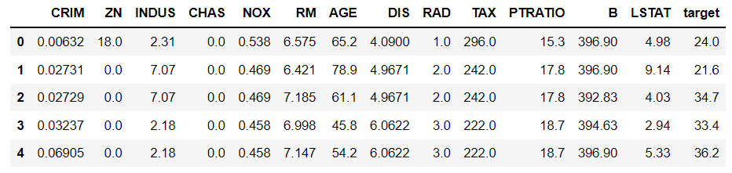

## 라소 회귀(Lasso Regression)

> 선형 회귀의 일종인 라소 회귀에 대해서 알아본다.


### 개념

> Linear Regression Method의 loss함수인 MSE에 가중치(w)에 대해 l1-norm을 사용해 penalty term을 추가한 방법이다.


### 수식


### 특성

* Ridge와 유사하지만 가중치가 0이 될 수도 있다.
  * 이러한 점은 어떤 특성은 완전히 제외될 수 있다는 뜻이다.
  * 따라서 다중공선성 문제를 방지할 수 있다.
* alpha의 값이 클수록 penaly term이 강조되어 w를 더 작게 만들어준다.


### 간단한 예제

* library 불러오기

  ```python
  import pandas as pd
  import numpy as np
  import seaborn as sns
  from sklearn.datasets import load_boston
  
  from sklearn.linear_model import Lasso
  from sklearn.pipeline import make_pipeline
  from sklearn.preprocessing import StandardScaler
  from sklearn.model_selection import train_test_split
  
  import matplotlib.pyplot as plt
  import matplotlib
  matplotlib.rcParams['font.family']='Malgun Gothic'
  matplotlib.rcParams['axes.unicode_minus'] = False
  
  import warnings
  warnings.simplefilter('ignore')
  ```

* data

  ```python
  boston = load_boston()
  
  df = pd.DataFrame(boston['data'], columns=boston.feature_names)
  df['target'] = boston.target
  ```

  

* model 생성 및 학습

  ```python
  model = make_pipeline(StandardScaler(), Lasso(alpha=2))
  model.fit(x_train, y_train)
  ```

* 결과

  ```python
  print( model.score( x_train, y_train) ) # 0.5921930889890816
  print( model.score( x_test, y_test) )   # 0.5820660838253111S
  ```

  