## Pycaret(1)

> AutoML의 하나인 `PyCaret`에 대해서 다룬다.


* ### 소개

  *  신흥강자로 부상한 AutoML 도구이다.
  * 자동으로 하기 때문에 성능이 낮다고 생각하면 안된다.
  * https://pycaret.org/


* ### 데이터

  ```python
  import os
  
  BASE_DIR = './data' 
  
  train_path = os.path.join(BASE_DIR, 'train.csv')
  test_path = os.path.join(base_dir, 'test.csv')
  
  train = pd.read_csv(train_path)
  test = pd.read_csv(test_path)
  
  train.head()
  ```

  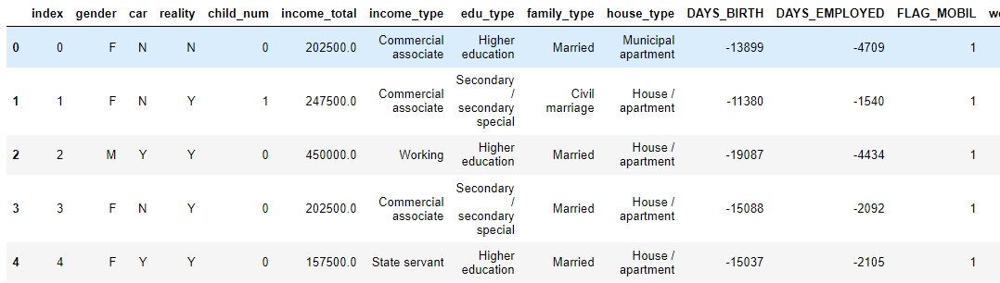


* ### 설치 및 불러오기

  ```python
  !pip install pycaret
  from pycaret.classification import *
  ```

  * 많은 삶들이 `*`를 사용해 전체 패키지를 불러온다.


* ### 셋업

  > 전체적인 시스템을 준비한다. 기본세팅으로 `data`,`target`(target 컬럼명), `fold`를 입력해준다.

  ```python
  setup(data=train,
        target='credit',
        fold=5,
        silent=True)
  ```

  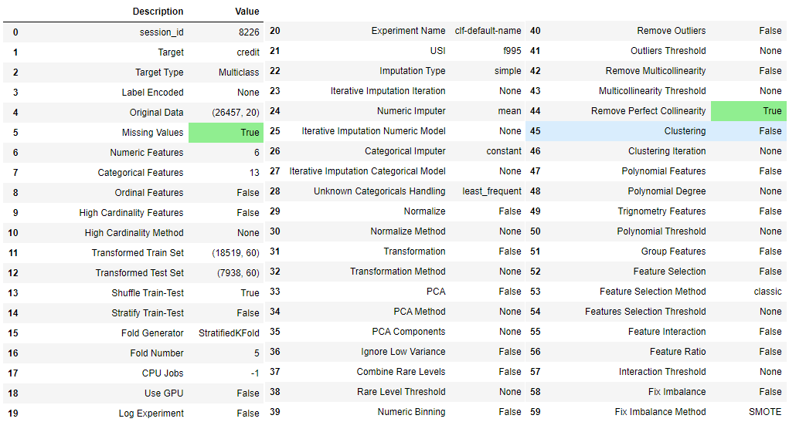


* ### Metric 확인 및 추가

  * 확인 : 사용할 수 있는 metic 정보를 알 수 있다.

    ```python
    get_metrics()
    ```

    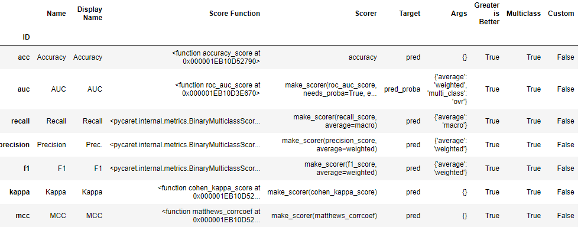

  * `LogLoss` metric 추가

    ```python
    add_metric('logloss',  # id
               name='LogLoss', 
               score_func=log_loss, 
               greater_is_better=False, 
               target='pred_proba')
    ```

    * `greater_is_better` : 클수록 좋은 값으로 취급할지인데 `LogLoss`값은 낮을수록 좋으므로 `False`를 입력해 준다.
    * `target`의 `default`는 `pred`이다.

  * 다시 확인 : 추가 되었음을 알 수 있다.

    ```python
    get_metrics()
    ```

    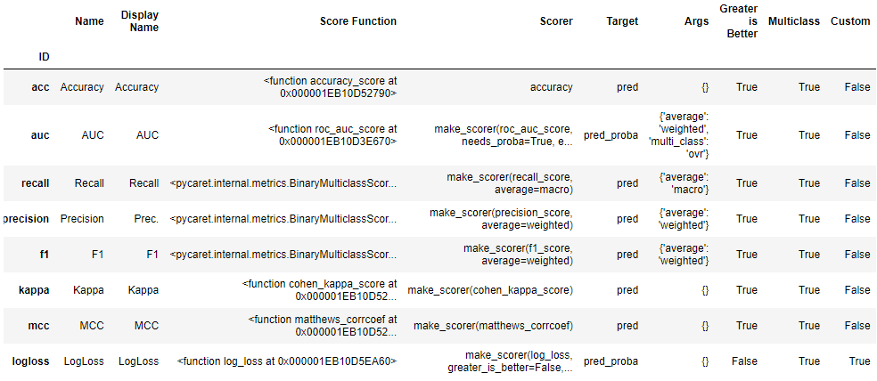


* ### 사용 가능 모델

  ```python
  models()
  ```

  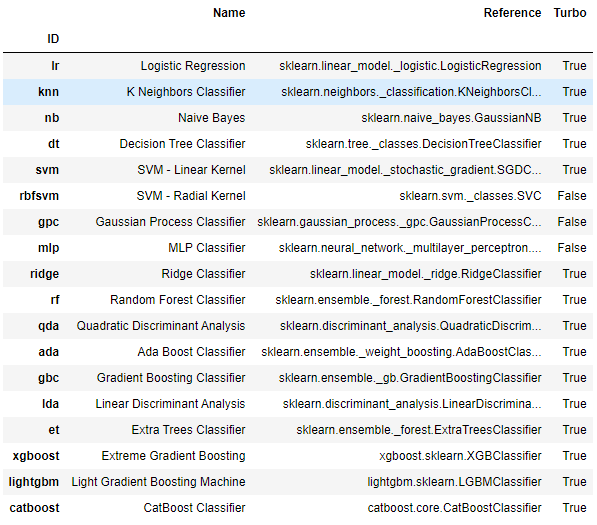


* ### 모델 한가지로 학습

  > lightgbm을 사용해 모델을 생성하고 학습 및 결과를 살펴본다.

  * 모델 생성 : 생성과 동시에 결과를 알려준다.

    ```python
    lightgbm = create_model(estimator='lightgbm')
    ```

    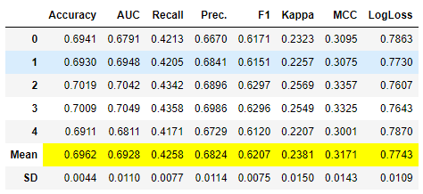

  * 모델 튜닝 : 여러가지 library로 hyperparameter 튜닝이 가능하다.

    * default : `'scikit-learn'`

      ```python
      tuned_lightgbm = tune_model(lightgbm)
      ```

      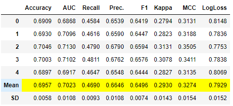

    * `'optuna'` : `!pip install optuna` 로 다운받아 가능하다.

      ```python
      tuned_lightgbm_optuna = tune_model(lightgbm, search_library='optuna')
      ```

      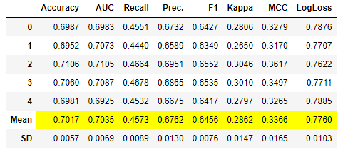

    * 그 밖에, `'tune-sklearn'`, `'scikit-optimize'`를 활용할 수 있다.

  * 시각화 : `plot_model`을 사용해 모델에 관해 편하게 시각화가 가능하다.

    * Validataion Curve

      ```python
      plot_model(tuned_lightgbm_optuna, plot='vc')
      ```

      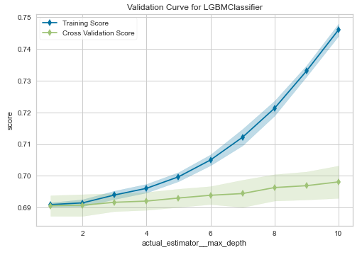

    * confusion_matrix

      ```python
      plot_model(tuned_lightgbm_optuna, plot='confusion_matrix')
      ```

      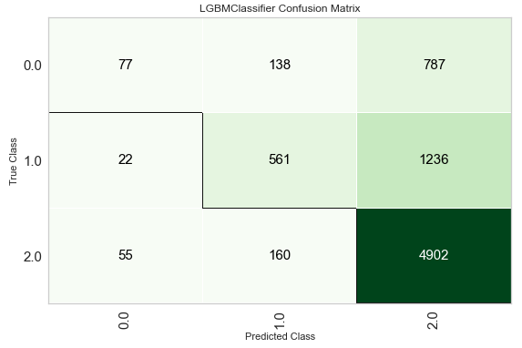

    * ROC curve

      ```python
      plot_model(tuned_lightgbm_optuna, plot='auc')
      ```

      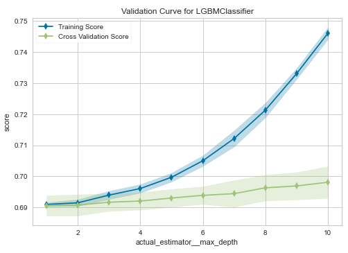

    * Feature Importance

      ```python
      plot_model(tuned_lightgbm_optuna, plot='feature_all')
      ```

      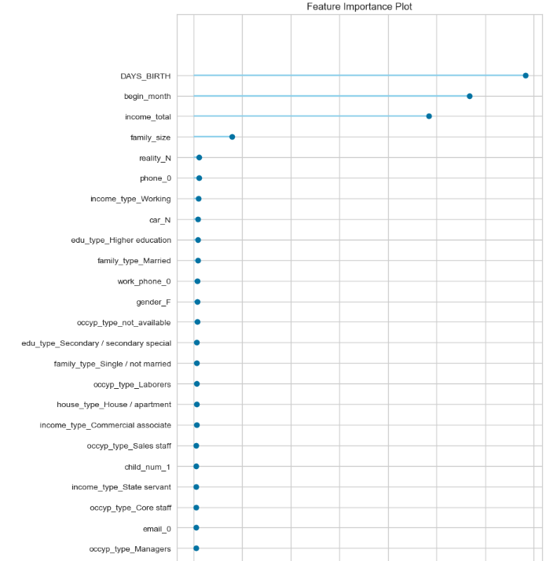

    * 참고 : `evaluate_model`을 통해 선택을 통해 모델 그래프나 정보를 볼 수 있다.

      ```python
      evaluate_model(tuned_lightgbm_optuna)
      ```

      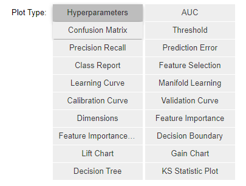

  * test set 예측 : 결과인 `class`와 `raw_score=True`를 설정시 확률까지 기존 `test`에 컬럼ㅇ로 추가되어  `DataFrame`을 생성해준다.

    ```python
    final_lgbm = finalize_model(tuned_lightgbm_optuna)
    res = predict_model(final_lgbm, test, raw_score=True)
    res.iloc[:,-4:]
    ```

    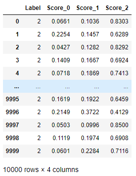

