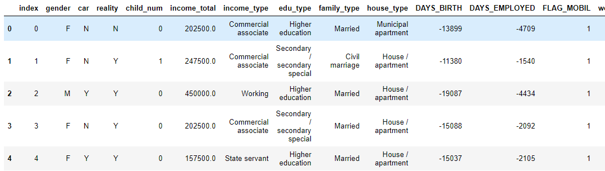
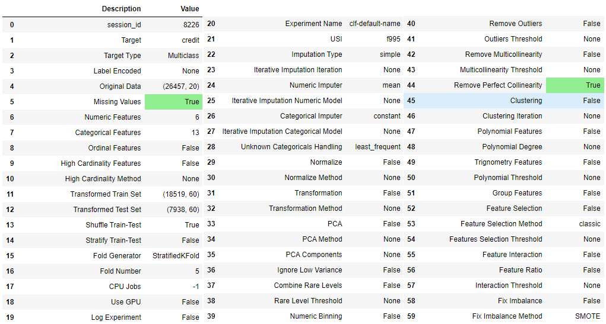
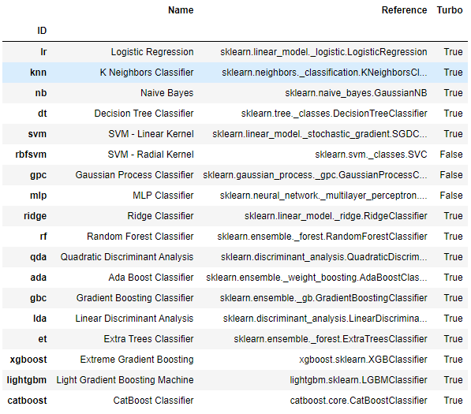
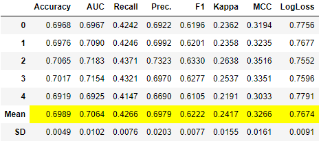

## Pycaret(2)

> AutoML의 하나인 `PyCaret`에 대해서 다룬다. [Pycaret(2)](./Pycaret2.md)과 사용 모델 확인 까지의 앞부분 내용은 같다.


* ### 소개

  *  신흥강자로 부상한 AutoML 도구이다.
  * 자동으로 하기 때문에 성능이 낮다고 생각하면 안된다.
  * https://pycaret.org/


* ### 데이터

  ```python
  import os
  
  BASE_DIR = './data' 
  
  train_path = os.path.join(BASE_DIR, 'train.csv')
  test_path = os.path.join(base_dir, 'test.csv')
  
  train = pd.read_csv(train_path)
  test = pd.read_csv(test_path)
  
  train.head()
  ```

  


* ### 설치 및 불러오기

  ```python
  !pip install pycaret
  from pycaret.classification import *
  ```

  * 많은 삶들이 `*`를 사용해 전체 패키지를 불러온다.


* ### 셋업

  > 전체적인 시스템을 준비한다. 기본세팅으로 `data`,`target`(target 컬럼명), `fold`를 입력해준다.

  ```python
  setup(data=train,
        target='credit',
        fold=5,
        silent=True)
  ```

  


* ### Metric 확인 및 추가

  * 확인 : 사용할 수 있는 metic 정보를 알 수 있다.

    ```python
    get_metrics()
    ```

    

  * `LogLoss` metric 추가

    ```python
    add_metric('logloss',  # id
               name='LogLoss', 
               score_func=log_loss, 
               greater_is_better=False, 
               target='pred_proba')
    ```

    * `greater_is_better` : 클수록 좋은 값으로 취급할지인데 `LogLoss`값은 낮을수록 좋으므로 `False`를 입력해 준다.
    * `target`의 `default`는 `pred`이다.

  * 다시 확인 : 추가 되었음을 알 수 있다.

    ```python
    get_metrics()
    ```

    


* ### 사용 가능 모델

  ```python
  models()
  ```

  


* ### 비교 모델로 Voting

  * `compare_models`를 사용해 여러모델의 결과를 한번에 알 수 있다.

    ```python
    best6 = compare_models(fold=5,                  # cv 개수
                           sort='logloss',          # metric 종류
                           n_select=6,              # 결과에서 좋은 모델 선택할 개수
                           exclude=['svm', 'ridge'] # 제외할 모델
                          )
    ```

    * 모델을 학습하고 나면 다음과 같은 `DataFrame`을 보여준다.

      

    ```python
    best6
    ## 결과
    [XGBClassifier(base_score=0.5, booster='gbtree', colsample_bylevel=1,
                   colsample_bynode=1, colsample_bytree=1, gamma=0, gpu_id=-1,
                   importance_type='gain', interaction_constraints='',
                   learning_rate=0.300000012, max_delta_step=0, max_depth=6,
                   min_child_weight=1, missing=nan, monotone_constraints='()',
                   n_estimators=100, n_jobs=-1, num_parallel_tree=1,
                   objective='multi:softprob', random_state=8226, reg_alpha=0,
                   reg_lambda=1, scale_pos_weight=None, subsample=1,
                   tree_method='auto', use_label_encoder=True, validate_parameters=1,
                   verbosity=0),
     <catboost.core.CatBoostClassifier at 0x1eb20bebcd0>,
     LGBMClassifier(boosting_type='gbdt', class_weight=None, colsample_bytree=1.0,
                    importance_type='split', learning_rate=0.1, max_depth=-1,
                    min_child_samples=20, min_child_weight=0.001, min_split_gain=0.0,
                    n_estimators=100, n_jobs=-1, num_leaves=31, objective=None,
                    random_state=8226, reg_alpha=0.0, reg_lambda=0.0, silent=True,
                    subsample=1.0, subsample_for_bin=200000, subsample_freq=0),
     GradientBoostingClassifier(ccp_alpha=0.0, criterion='friedman_mse', init=None,
                                learning_rate=0.1, loss='deviance', max_depth=3,
                                max_features=None, max_leaf_nodes=None,
                                min_impurity_decrease=0.0, min_impurity_split=None,
                                min_samples_leaf=1, min_samples_split=2,
                                min_weight_fraction_leaf=0.0, n_estimators=100,
                                n_iter_no_change=None, presort='deprecated',
                                random_state=8226, subsample=1.0, tol=0.0001,
                                validation_fraction=0.1, verbose=0,
                                warm_start=False),
     GaussianNB(priors=None, var_smoothing=1e-09),
     LinearDiscriminantAnalysis(n_components=None, priors=None, shrinkage=None,
                                solver='svd', store_covariance=False, tol=0.0001)]
    ```

    ```python
    len(best6)
    # 6
    ```

    * LogLoss값이 낮은 순서로 `list`에 저장된다.

  * voting 모델 만들기

    ```python
    voting = blend_models(estimator_list=best6, # 위에서 만들어진 6개의 모델이 담긴 list
                          fold=5,               # cv
                          optimize='logloss',   # cost 함수가 아닌 score같다.
                          method='auto' # method가 auto인 경우 soft voting을 사용하고 불가능한 모델이 있다면 hard voting을 시도한다.
                         )
    ```

    

    ```python
    voting
    ## 결과
    VotingClassifier(estimators=[('xgboost',
                                  XGBClassifier(base_score=0.5, booster='gbtree',
                                                colsample_bylevel=1,
                                                colsample_bynode=1,
                                                colsample_bytree=1, gamma=0,
                                                gpu_id=-1, importance_type='gain',
                                                interaction_constraints='',
                                                learning_rate=0.300000012,
                                                max_delta_step=0, max_depth=6,
                                                min_child_weight=1, missing=nan,
                                                monotone_constraints='()',
                                                n_estimators=100, n_jobs=-1...
                                                             random_state=8226,
                                                             subsample=1.0,
                                                             tol=0.0001,
                                                             validation_fraction=0.1,
                                                             verbose=0,
                                                             warm_start=False)),
                                 ('nb',
                                  GaussianNB(priors=None, var_smoothing=1e-09)),
                                 ('lda',
                                  LinearDiscriminantAnalysis(n_components=None,
                                                             priors=None,
                                                             shrinkage=None,
                                                             solver='svd',
                                                             store_covariance=False,
                                                             tol=0.0001))],
                     flatten_transform=True, n_jobs=-1, verbose=False,
                     voting='soft', weights=None)
    ```

    ```python
    type(voting)
    # sklearn.ensemble._voting.VotingClassifier
    ```

    * `sklearn`의 `VotingClassifier`임을 알 수 있다.

  * `'optuna'`를 활용해 모델 튜닝

    ```python
    voting_tune_optuna = tune_model(voting, search_library='optuna')
    ```

    

    ```python
    voting_tune_optuna
    ## 결과
    VotingClassifier(estimators=[('xgboost',
                                  XGBClassifier(base_score=0.5, booster='gbtree',
                                                colsample_bylevel=1,
                                                colsample_bynode=1,
                                                colsample_bytree=1, gamma=0,
                                                gpu_id=-1, importance_type='gain',
                                                interaction_constraints='',
                                                learning_rate=0.300000012,
                                                max_delta_step=0, max_depth=6,
                                                min_child_weight=1, missing=nan,
                                                monotone_constraints='()',
                                                n_estimators=100, n_jobs=-1...
                                  GaussianNB(priors=None, var_smoothing=1e-09)),
                                 ('lda',
                                  LinearDiscriminantAnalysis(n_components=None,
                                                             priors=None,
                                                             shrinkage=None,
                                                             solver='svd',
                                                             store_covariance=False,
                                                             tol=0.0001))],
                     flatten_transform=True, n_jobs=-1, verbose=False,
                     voting='soft',
                     weights=[0.8935957404176336, 0.2966272856190533,
                              0.5839363934433777, 0.6254688659302372,
                              0.12890313666331554, 0.09569782255345581])
    ```

  * test set 예측(1) : `predict_model` 사용

    ```python
    res = predict_model(voting_tune_optuna, 
                        data=test, 
                        raw_score=True)
    res.iloc[:,-4:]
    ```

    

  * test set예측(2) :`sklearn`의  `pipeline`형식으로 바꾸어 `predict_proba` 메소드를 사용할 수 있다.
      * 파이프라인 불러오기
  
        ```python
        prep_pipe = get_config('prep_pipe')
        type(prep_pipe) # sklearn.pipeline.Pipeline
        ```
  
        ```python
        prep_pipe
        ## 결과
        Pipeline(memory=None,
                 steps=[('dtypes',
                         DataTypes_Auto_infer(categorical_features=[],
                                              display_types=False, features_todrop=[],
                                              id_columns=['index'],
                                              ml_usecase='classification',
                                              numerical_features=[], target='credit',
                                              time_features=[])),
                        ('imputer',
                         Simple_Imputer(categorical_strategy='not_available',
                                        fill_value_categorical=None,
                                        fill_value_numerical=None,
                                        numer...
                        ('scaling', 'passthrough'), ('P_transform', 'passthrough'),
                        ('binn', 'passthrough'), ('rem_outliers', 'passthrough'),
                        ('cluster_all', 'passthrough'),
                        ('dummy', Dummify(target='credit')),
                        ('fix_perfect', Remove_100(target='credit')),
                        ('clean_names', Clean_Colum_Names()),
                        ('feature_select', 'passthrough'), ('fix_multi', 'passthrough'),
                        ('dfs', 'passthrough'), ('pca', 'passthrough')],
                 verbose=False)
        ```
  
      * 파이프라인에 위에서 만들어진 모델 추가
  
        ```python
        prep_pipe.steps.append(['trained_model', voting_tune_optuna])
        prep_pipe
        ## 결과
        Pipeline(memory=None,
                 steps=[('dtypes',
                         DataTypes_Auto_infer(categorical_features=[],
                                              display_types=False, features_todrop=[],
                                              id_columns=['index'],
                                              ml_usecase='classification',
                                              numerical_features=[], target='credit',
                                              time_features=[])),
                        ('imputer',
                         Simple_Imputer(categorical_strategy='not_available',
                                        fill_value_categorical=None,
                                        fill_value_numerical=None,
                                        numer...
                                                                  var_smoothing=1e-09)),
                                                      ('lda',
                                                       LinearDiscriminantAnalysis(n_components=None,
                                                                                  priors=None,
                                                                                  shrinkage=None,
                                                                                  solver='svd',
                                                                                  store_covariance=False,
                                                                                  tol=0.0001))],
                                          flatten_transform=True, n_jobs=-1,
                                          verbose=False, voting='soft',
                                          weights=[0.8935957404176336,
                                                   0.2966272856190533,
                                                   0.5839363934433777,
                                                   0.6254688659302372,
                                                   0.12890313666331554,
                                                   0.09569782255345581])]],
                 verbose=False)
        ```
  
    * test set 예측
  
      ```python
      prep_pipe.predict_proba(test)
      ## 결과
      array([[0.08422577, 0.10594238, 0.80983186],
             [0.12410099, 0.15575107, 0.72014793],
             [0.10716005, 0.20692658, 0.68591336],
             ...,
             [0.08977594, 0.19165872, 0.71856534],
             [0.11115337, 0.16746082, 0.72138581],
             [0.05171066, 0.23571267, 0.71257667]])
      ```
  

