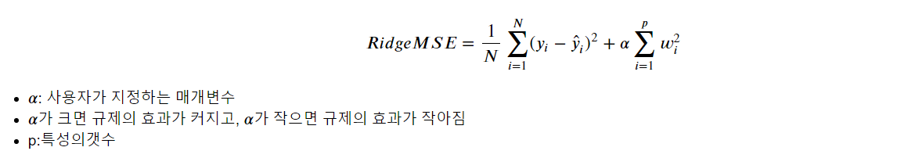

## 리지 회귀(Ridge Regression)

> 선형 회귀의 일종인 리지 회귀에 대해서 알아본다.


### 개념

> Linear Regression Method의 loss함수인 MSE에 가중치(w)에 대해 l2-norm을 사용해 penalty term을 추가한 방법이다.


### 수식




### 특성

* 가중치의 값이 0은 아니지만 최대한 작게 만들어 모델을 단순하게 해준다.
  * feature가 출력 값에 영향을 최소로 만들도록 한다.
* alpha의 값이 클수록 penaly term이 강조되어 w를 더 작게 만들어준다.
* 이러한 방법은 다중공성선(multicollinearity) 문제를 방지해 모델의 과대적합을 막을 수 있다.


### 간단한 예제

* library 불러오기

  ```python
  import pandas as pd
  import numpy as np
  import seaborn as sns
  from sklearn.datasets import load_boston
  
  from sklearn.linear_model import Ridge
  from sklearn.pipeline import make_pipeline
  from sklearn.preprocessing import StandardScaler
  from sklearn.model_selection import train_test_split
  
  import matplotlib.pyplot as plt
  import matplotlib
  matplotlib.rcParams['font.family']='Malgun Gothic'
  matplotlib.rcParams['axes.unicode_minus'] = False
  
  import warnings
  warnings.simplefilter('ignore')
  ```

* data

  ```python
  boston = load_boston()
  
  df = pd.DataFrame(boston['data'], columns=boston.feature_names)
  df['target'] = boston.target
  ```

  

  ```python
  x_data, y_data = df.iloc[:,:-1], df.iloc[:, -1]
  ```

  ```python
  x_train, x_test, y_train, y_test = train_test_split(x_data, y_data, test_size=0.2, random_state=1)
  ```

* model 생성 및 학습

  ```python
  model = make_pipeline(StandardScaler(), Ridge(alpha=2))
  model.fit(x_train, y_train)
  ```

* 결과

  ```R
  print( model.score( x_train, y_train) ) # 0.7292737125413905
  print( model.score( x_test, y_test) )   # 0.7633381938790602
  ```