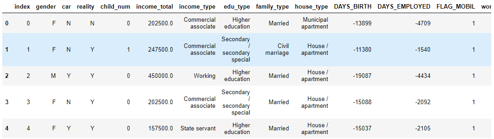
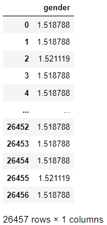
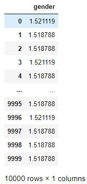
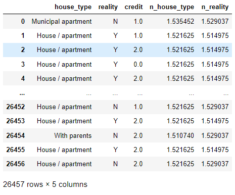

## Target Encoding

> `target`을 이용해 범주형 변수를 수치형 변수로 변환하는 방법에 대해서 알아본다.


* ### 소개

  > 범주형 변수의 각 클래스별로 target의 평균값으로 치환해 사용한다. 이때 고려할 사항이 상당히 많다.

  * target의 정보가 노출되기 때문에 KFold를 사용한다.
  * noise를 더하여 누출을 방지한다.
  * 불균형 방지를 위해 데이터 평균 및 가중치 추가한다.


* ### 데이터

  * 다음과 같이 one-hot 인코딩까지 처리 된 데이터에 대해서 적용한다.

    ```python
    import os
    
    BASE_DIR = './data' 
    train_path = os.path.join(BASE_DIR, 'train.csv')
    test_path = os.path.join(BASE_DIR, 'test.csv')
    
    data = pd.read_csv(train_path)
    test_data = pd.read_csv(test_path)
    
    data.head()
    ```

    

  

* ### 설치

  ```python
  !pip install category_encoders
  ```


* ### library 불러오기

  ```python
  from category_encoders.target_encoder import TargetEncoder
  ```

  

* ### 예제

  * 1개의 컬럼

    * `gender` 컬럼 별 `credit`(target) 평균 확인

      ```python
      data.groupby(['gender'])['credit'].mean()
      # gender
      # F    1.518788
      # M    1.521119
      # Name: credit, dtype: float64
      ```

    * 변환 : 위에서 확인한 여성, 남성의 값이 각각 1.1518 / 1.521119 값으로 변경됐다.

      ```python
      te = TargetEncoder()
      dadta['gender'] = te.fit_transform(data['gender'], data['credit'])
      data[['gender']]
      ```

      

    * test 데이터 변환

      ```python
      test_data['gender'] = te.transform(test_data['gender'])
      test_data[['gender']]
      ```

      

    

  * 2개의 컬럼

    * `house_type`, `reality` 별 `credit` 평균

      ```python
      data.groupby(['house_type'])['credit'].mean()
      # house_type
      # Co-op apartment        1.472727
      # House / apartment      1.521625
      # Municipal apartment    1.535452
      # Office apartment       1.494737
      # Rented apartment       1.424242
      # With parents           1.510740
      # Name: credit, dtype: float64
      
      data.groupby(['reality'])['credit'].mean()
      # reality
      # N    1.529037
      # Y    1.514975
      # Name: credit, dtype: float64
      ```

    * 변환

      ```python
      te = TargetEncoder()
      tmp = te.fit_transform(data[['house_type', 'reality']], data['credit'])
      tmp.columns= ['n_house_type', 'n_reality']
      data[['house_type', 'reality', 'credit']].join(tmp)
      ```

      

