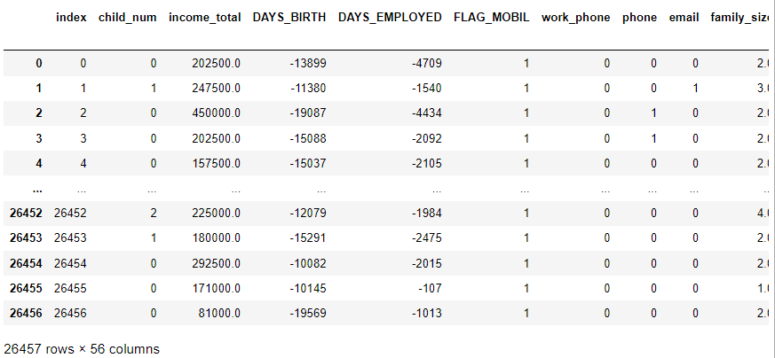
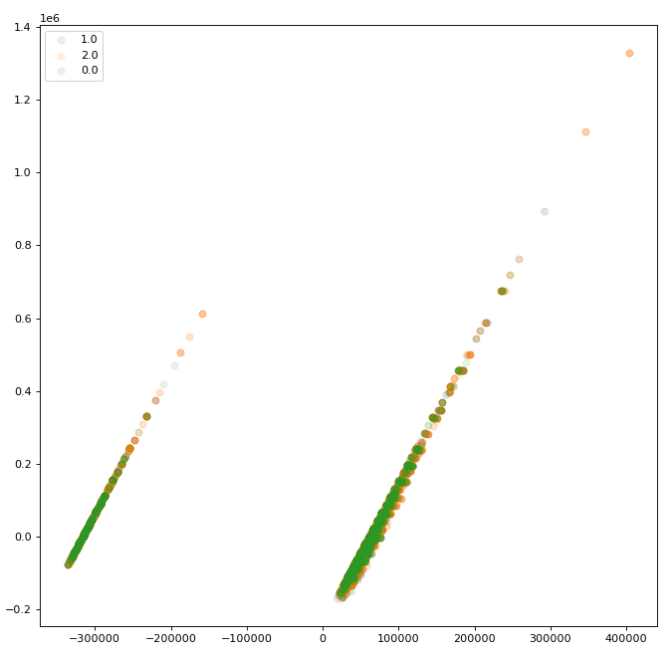
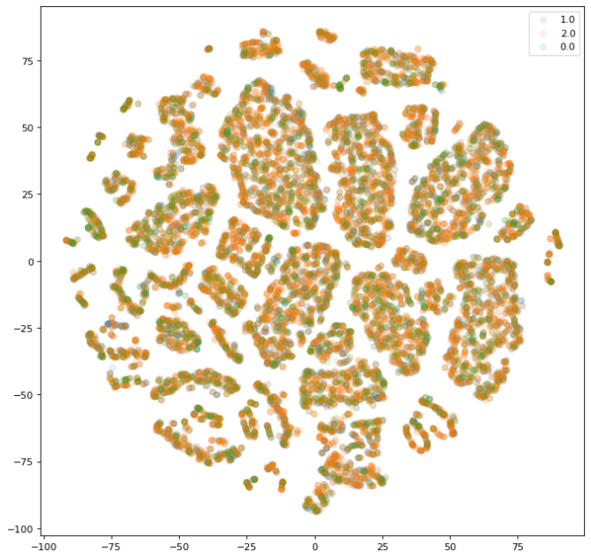
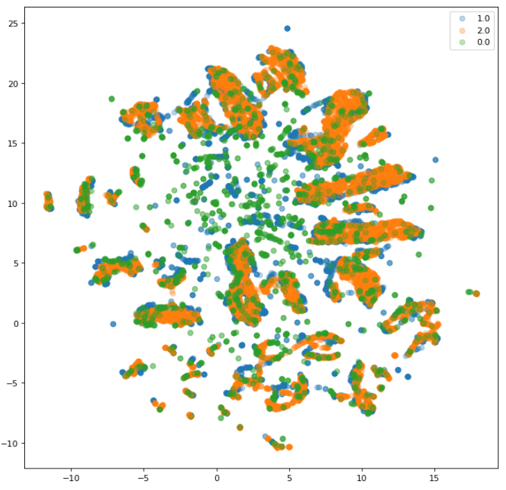

## PCA, T-SNE, UMAP

> PCA, T-SNE, UMAP의 `python` 사용법을 알아본다.


* ### data

  * 다음과 같이 one-hot 인코딩까지 처리 된 데이터에 대해서 적용한다.

    ```python
    data_trans
    ```

    

  

* ### PCA

  * library 불러오기

    ```python
    from sklearn.decomposition import PCA
    ```

  * 변환

    ```python
    pca = PCA(n_components=2)
    data_pca = pca.fit_transform(data_trans, y_data)
    ```

    

    ```python
    data_pca
    ## 결과
    array([[  65581.84112473,   -1092.89075003],
           [  73700.95072806,   43274.10189553],
           [ 126510.35036146,  238798.96759837],
           ...,
           [  85324.58253225,   86769.91265421],
           [  53388.06206901,  -30472.9642158 ],
           [  31808.72519467, -117834.56410323]])
    ```

  * 그래프

    ```python
    fig, ax = plt.subplots(1, 1, figsize=(10, 10), dpi=80)
    
    for i in y_data.unique():
        ax.scatter(data_pca[:,0][y_data==i], data_pca[:,1][y_data==i], alpha=0.1, label=i)
    ax.legend()
    plt.show()
    ```

    


* ### T-SNE

    * library 불러오기

      ```python
      from sklearn.manifold import TSNE
      ```

    * 변환

      ```python
      tsne = TSNE(n_components=2)
      data_tsne = tsne.fit_transform(data_trans, y_data)
      ```

      ```python
      data_tsne
      ## 결과
      array([[ 19.552238,  -4.846582],
             [-42.105877,  39.41363 ],
             [-12.876522,  78.7327  ],
             ...,
             [-57.621014, -22.294928],
             [ 79.365776,  17.366955],
             [ 23.560495, -62.9807  ]], dtype=float32)
      ```
      
    * 그래프

      ```python
      fig, ax = plt.subplots(1, 1, figsize=(10, 10), dpi=80)
      
      for i in y_data.unique():
          ax.scatter(data_tsne[:,0][y_data==i], data_tsne[:,1][y_data==i], alpha=0.1, label=i)
      ax.legend()
      plt.show()
      ```
      
      

* ### UMAP

    * library 불러오기 : 현재 `sklearn`에 없기 때문에 `pip install umap`을 해줘야 한다.

      ```python
      from umap import UMAP
      ```

    * 변환

      ```python
      umap = UMAP(n_components=2, random_state=0)
      data_umap = umap.fit_transform(data_trans, y_data)
      data_umap
      ```
      
      ```python
      data_umap
      ## 결과
      array([[10.199278 ,  1.7216262],
             [ 6.033099 ,  1.1099709],
             [-6.250575 , -4.41441  ],
             ...,
             [-2.3506534,  3.9079535],
             [ 9.102947 ,  9.33384  ],
             [ 4.8059664, 19.702581 ]], dtype=float32)
      ```
      
    * 그래프
    
      ```python
      fig, ax = plt.subplots(1, 1, figsize=(10, 10), dpi=80)
      
      for i in y_data.unique():
          ax.scatter(data_umap[:,0][y_data==i], data_umap[:,1][y_data==i], alpha=0.3, label=i)
      ax.legend()
      plt.show()
      ```
      
      

