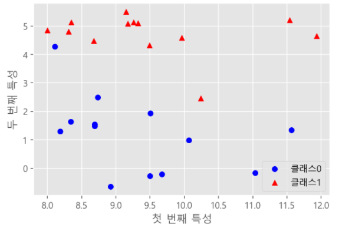
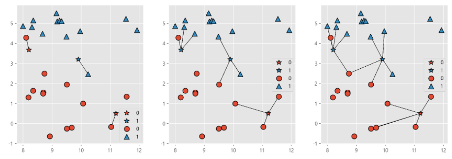
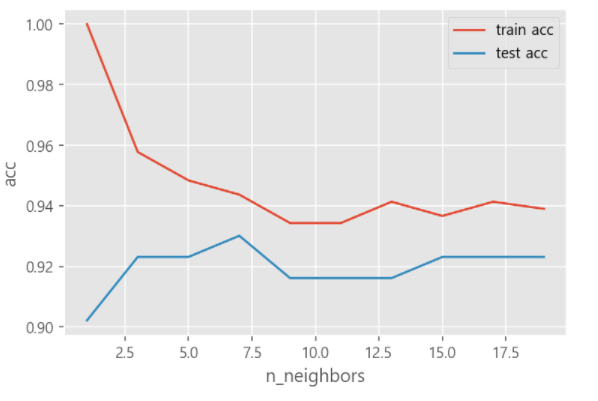
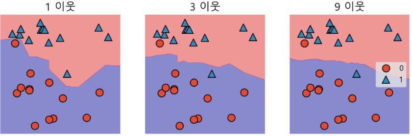

# k-최근접 이웃 알고리즘(분류)(K-Nearest Neighbor)

> 새로운 데이터로부터 가장 가까운 k개의 기존 데이터를 찾아 가장 많이 분류된 값(**다수결**)으로 현재 데이터를 분류하는 알고리즘이다.


* ### 전반적인 알고리즘

  새로운 데이터 입력 → 거리 계산 → k개의 이웃 찾기 → 이웃 레이블에 기반한 데이터 분류

  

* ### 데이터셋1

  ```python
  import mglearn
  x, y = mglearn.datasets.make_forge()
  display(x)
  display(y)
  ```

  ```
  array([[ 9.96346605,  4.59676542],
         [11.0329545 , -0.16816717],
         [11.54155807,  5.21116083],
         [ 8.69289001,  1.54322016],
         [ 8.1062269 ,  4.28695977],
         [ 8.30988863,  4.80623966],
         [11.93027136,  4.64866327],
         [ 9.67284681, -0.20283165],
         [ 8.34810316,  5.13415623],
         [ 8.67494727,  4.47573059],
         [ 9.17748385,  5.09283177],
         [10.24028948,  2.45544401],
         [ 8.68937095,  1.48709629],
         [ 8.92229526, -0.63993225],
         [ 9.49123469,  4.33224792],
         [ 9.25694192,  5.13284858],
         [ 7.99815287,  4.8525051 ],
         [ 8.18378052,  1.29564214],
         [ 8.7337095 ,  2.49162431],
         [ 9.32298256,  5.09840649],
         [10.06393839,  0.99078055],
         [ 9.50048972, -0.26430318],
         [ 8.34468785,  1.63824349],
         [ 9.50169345,  1.93824624],
         [ 9.15072323,  5.49832246],
         [11.563957  ,  1.3389402 ]])
  array([1, 0, 1, 0, 0, 1, 1, 0, 1, 1, 1, 1, 0, 0, 1, 1, 1, 0, 0, 1, 0, 0,
         0, 0, 1, 0])
  ```

  ```python
  import matplotlib.pyplot as plt
  
  x_cir = x[y==0, :]
  x_tri = x[y==1, :]
  plt.scatter(x_cir[:,0], x_cir[:,1], color='b', marker='o', label = '클래스0')
  plt.scatter(x_tri[:,0], x_tri[:,1], color='r', marker='^', label = '클래스1')
  plt.legend(loc=4)
  plt.xlabel('첫 번째 특성')
  plt.ylabel('두 번째 특성')
  plt.show()
  ```

  

  ```python
  fig = plt.figure(figsize=(15, 5))
  fig.add_subplot(1, 3, 1)
  mglearn.plots.plot_knn_classification(n_neighbors=1)
  plt.legend(loc=4)
  fig.add_subplot(1, 3, 2)
  mglearn.plots.plot_knn_classification(n_neighbors=3)
  plt.legend(loc=5)
  fig.add_subplot(1, 3, 3)
  mglearn.plots.plot_knn_classification(n_neighbors=5)
  plt.legend(loc=5)
  plt.show()
  ```

  

  * 왼쪽부터 오른쪽으로 인접 이웃을 1개, 3개, 5개 선택했을 때이다.


* ### 데이터셋 2

  ```python
  from sklearn.datasets import load_breast_cancer
  
  cancer = load_breast_cancer()
  cancer['data'], cancer['target']
  
  ```

  ```
  (array([[1.799e+01, 1.038e+01, 1.228e+02, ..., 2.654e-01, 4.601e-01,
           1.189e-01],
          [2.057e+01, 1.777e+01, 1.329e+02, ..., 1.860e-01, 2.750e-01,
           8.902e-02],
          [1.969e+01, 2.125e+01, 1.300e+02, ..., 2.430e-01, 3.613e-01,
           8.758e-02],
          ...,
          [1.660e+01, 2.808e+01, 1.083e+02, ..., 1.418e-01, 2.218e-01,
           7.820e-02],
          [2.060e+01, 2.933e+01, 1.401e+02, ..., 2.650e-01, 4.087e-01,
           1.240e-01],
          [7.760e+00, 2.454e+01, 4.792e+01, ..., 0.000e+00, 2.871e-01,
           7.039e-02]]),
   array([0, 0, 0, 0, 0, 0, 0, 0, 0, 0, 0, 0, 0, 0, 0, 0, 0, 0, 0, 1, 1, 1,
          0, 0, 0, 0, 0, 0, 0, 0, 0, 0, 0, 0, 0, 0, 0, 1, 0, 0, 0, 0, 0, 0,
          0, 0, 1, 0, 1, 1, 1, 1, 1, 0, 0, 1, 0, 0, 1, 1, 1, 1, 0, 1, 0, 0,
          1, 1, 1, 1, 0, 1, 0, 0, 1, 0, 1, 0, 0, 1, 1, 1, 0, 0, 1, 0, 0, 0,
          1, 1, 1, 0, 1, 1, 0, 0, 1, 1, 1, 0, 0, 1, 1, 1, 1, 0, 1, 1, 0, 1,
          1, 1, 1, 1, 1, 1, 1, 0, 0, 0, 1, 0, 0, 1, 1, 1, 0, 0, 1, 0, 1, 0,
          0, 1, 0, 0, 1, 1, 0, 1, 1, 0, 1, 1, 1, 1, 0, 1, 1, 1, 1, 1, 1, 1,
          1, 1, 0, 1, 1, 1, 1, 0, 0, 1, 0, 1, 1, 0, 0, 1, 1, 0, 0, 1, 1, 1,
          1, 0, 1, 1, 0, 0, 0, 1, 0, 1, 0, 1, 1, 1, 0, 1, 1, 0, 0, 1, 0, 0,
          0, 0, 1, 0, 0, 0, 1, 0, 1, 0, 1, 1, 0, 1, 0, 0, 0, 0, 1, 1, 0, 0,
          1, 1, 1, 0, 1, 1, 1, 1, 1, 0, 0, 1, 1, 0, 1, 1, 0, 0, 1, 0, 1, 1,
          1, 1, 0, 1, 1, 1, 1, 1, 0, 1, 0, 0, 0, 0, 0, 0, 0, 0, 0, 0, 0, 0,
          0, 0, 1, 1, 1, 1, 1, 1, 0, 1, 0, 1, 1, 0, 1, 1, 0, 1, 0, 0, 1, 1,
          1, 1, 1, 1, 1, 1, 1, 1, 1, 1, 1, 0, 1, 1, 0, 1, 0, 1, 1, 1, 1, 1,
          1, 1, 1, 1, 1, 1, 1, 1, 1, 0, 1, 1, 1, 0, 1, 0, 1, 1, 1, 1, 0, 0,
          0, 1, 1, 1, 1, 0, 1, 0, 1, 0, 1, 1, 1, 0, 1, 1, 1, 1, 1, 1, 1, 0,
          0, 0, 1, 1, 1, 1, 1, 1, 1, 1, 1, 1, 1, 0, 0, 1, 0, 0, 0, 1, 0, 0,
          1, 1, 1, 1, 1, 0, 1, 1, 1, 1, 1, 0, 1, 1, 1, 0, 1, 1, 0, 0, 1, 1,
          1, 1, 1, 1, 0, 1, 1, 1, 1, 1, 1, 1, 0, 1, 1, 1, 1, 1, 0, 1, 1, 0,
          1, 1, 1, 1, 1, 1, 1, 1, 1, 1, 1, 1, 0, 1, 0, 0, 1, 0, 1, 1, 1, 1,
          1, 0, 1, 1, 0, 1, 0, 1, 1, 0, 1, 0, 1, 1, 1, 1, 1, 1, 1, 1, 0, 0,
          1, 1, 1, 1, 1, 1, 0, 1, 1, 1, 1, 1, 1, 1, 1, 1, 1, 0, 1, 1, 1, 1,
          1, 1, 1, 0, 1, 0, 1, 1, 0, 1, 1, 1, 1, 1, 0, 0, 1, 0, 1, 0, 1, 1,
          1, 1, 1, 0, 1, 1, 0, 1, 0, 1, 0, 0, 1, 1, 1, 0, 1, 1, 1, 1, 1, 1,
          1, 1, 1, 1, 1, 0, 1, 0, 0, 1, 1, 1, 1, 1, 1, 1, 1, 1, 1, 1, 1, 1,
          1, 1, 1, 1, 1, 1, 1, 1, 1, 1, 1, 1, 0, 0, 0, 0, 0, 0, 1]))
  ```

  

  ```python
  x_train, x_test, y_train, y_test = train_test_split(cancer['data'], cancer['target'], random_state=66,stratify=cancer.target)
  ```

  

* ### 데이터셋2 예측 결과

  ```python
  from sklearn.neighbors import KNeighborsClassifier
  train_acc, test_acc = [], []
  nbs_settings = range(1, 20, 2)
  
  for nb in nbs_settings:
      clf = KNeighborsClassifier(n_neighbors=nb)
      clf.fit(x_train, y_train)
      train_acc.append(clf.score(x_train, y_train))
      test_acc.append(clf.score(x_test, y_test))
  
  
  plt.plot(nbs_settings, train_acc, label='train acc')
  plt.plot(nbs_settings, test_acc, label='test acc')
  plt.xlabel('n_neighbors')
  plt.ylabel('acc')
  plt.legend()
  plt.show()
  ```

  

  * 이웃의 수가 매우 적을 때는 train set에 대해서는 매우 잘 예측한다.
    * 이웃의 수가 적을 수록 모델의 복잡도가 크기 때문에 overfitting의 문제점이 있다.
  * 이웃의 수가 너무 높으면 모델의 복잡도는 단순해지지만 정확도는 떨어지게 된다.


* ### 추가적인 내용

  * Metric

    * sklearn에서는 minkowski(lp)중 p=2가 default이다.
    * Manhattan distance로 사용되는 경우도 있는듯 하다.

  * target의 class가 집중된 영역을 나눠주는 결정 경계(decision boundary)를 볼 수 있다.

    

  

