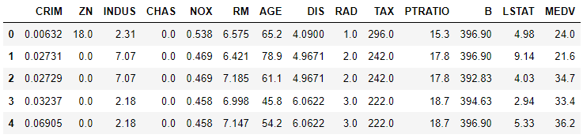

## pipeline(2)

> `sklearn`에서 제공하는 표준적인 방법인 `Pipeline`과 간소화된 방법인 `make_pipeline` 함수에 대해서 알아본다.


### Pipeline

> 별명을 사용해 pipeline을 만드는 표준적인 방법이다.


* 필요한 library

  ```python
  import numpy as np
  import pandas as pd
  from sklearn.preprocessing import StandardScaler
  from sklearn.datasets import load_boston
  from sklearn.pipeline import Pipeline
  from sklearn.model_selection import train_test_split
  from sklearn.linear_model import SGDRegressor
  ```

  - `Pipeline`은 `sklearn`의 `pipeline`에 포함되어 있다.

- data : boston data를 사용한다.

  ```python
  boston = load_boston()
  
  boston.keys()
  # dict_keys(['data', 'target', 'feature_names', 'DESCR', 'filename'])
  
  type(boston['data'])
  # numpy.ndarray
  ```

  ```python
  boston_df = pd.DataFrame(boston['data'])
  boston_df['MEDV'] = boston['target']
  boston_df.head()
  ```

  

  ```python
  x_data, y_data = boston_df.iloc[:,:-1].values, boston_df['MEDV'].values
  x_train, x_test, y_train, y_test = train_test_split(x_data, y_data, test_size=0.2, random_state=1)
  ```

* <u>`Pipeline`으로 model pipeline 생성</u>

  ```python
  model = Pipeline([('scaler', StandardScaler()), ('sgd', SGDRegressor())])
  
  model.steps
  # [('scaler', StandardScaler()), ('sgd', SGDRegressor())]
  
  model.get_params
  # <bound method Pipeline.get_params of Pipeline(steps=[('scaler', StandardScaler()), ('sgd', SGDRegressor())])>
  ```

  * `Pipeline` 인수로 `list` 형태로 들어가며 원소로 `tuple`로 (별명, 함수) 형태로 들어간다.

* 학습 및 결과

  ```python
  model.fit(x_train, y_train)
  # Pipeline(steps=[('scaler', StandardScaler()), ('sgd', SGDRegressor())])
  ```

  ```python
  print(model.score(x_train, y_train)) # 0.7276963909017751
  print(model.score(x_test, y_test)) # 0.763896702276611
  ```

  