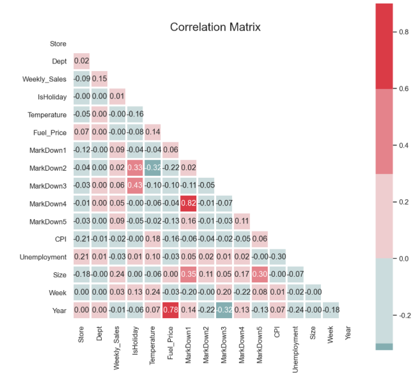

# 상관분석(Correlation Analysis) 시각화

> 상관분석의 시각화에 대해 다룬다.


###  seaborn heatmap활용

* heatmap 기본형

  ```python
  seaborn.heatmap(data, *, vmin=None, vmax=None, cmap=None, center=None, robust=False, annot=None, fmt='.2g', annot_kws=None, linewidths=0, linecolor='white', cbar=True, cbar_kws=None, cbar_ax=None, square=False, xticklabels='auto', yticklabels='auto', mask=None, ax=None, **kwargs)
  ```

  * vmin, vmax : floats, 색상관련
  * cmap : colormap name or object
  * center : colormap 중앙값 
  * fmt : string format, 소수점 결정
  * annot = True : 각 cell에 값을 기입
  * square : colorbar를 제외하고 정사각형으로 만듦
  * linewidths : cell간의 구분선 너비


* diverging_palette 기본형

  ```python
  seaborn.diverging_palette
  seaborn.diverging_palette(h_neg, h_pos, s=75, l=50, sep=1, n=6, center='light', as_cmap=False)
  ```

  * h_neg, h_pos : float in [0, 359] , hue를 나타낸다.
  * as_cmap : bool,  If True, return a `matplotlib.colors.Colormap`


* 예제

  * 데이터

    ```python
    train_detail.info()
    ```

    ```python
    <class 'pandas.core.frame.DataFrame'>
    RangeIndex: 421570 entries, 0 to 421569
    Data columns (total 18 columns):
     #   Column        Non-Null Count   Dtype         
    ---  ------        --------------   -----         
     0   Store         421570 non-null  int64         
     1   Dept          421570 non-null  int64         
     2   Date          421570 non-null  datetime64[ns]
     3   Weekly_Sales  421570 non-null  float64       
     4   IsHoliday     421570 non-null  bool          
     5   Temperature   421570 non-null  float64       
     6   Fuel_Price    421570 non-null  float64       
     7   MarkDown1     150681 non-null  float64       
     8   MarkDown2     111248 non-null  float64       
     9   MarkDown3     137091 non-null  float64       
     10  MarkDown4     134967 non-null  float64       
     11  MarkDown5     151432 non-null  float64       
     12  CPI           421570 non-null  float64       
     13  Unemployment  421570 non-null  float64       
     14  Type          421570 non-null  object        
     15  Size          421570 non-null  int64         
     16  Week          421570 non-null  UInt32        
     17  Year          421570 non-null  UInt32        
    dtypes: UInt32(2), bool(1), datetime64[ns](1), float64(10), int64(3), object(1)
    memory usage: 52.7+ MB
    ```

  * 그래프

    ```python
    corr = train_detail.corr() # 상관계수 계산
    
    plt.figure(figsize=(10,10))
    sns.set(style='white')  # 배경 흰색으로 변경
    cmap = sns.diverging_palette(200, 10, as_cmap=False) #cmap 설정
    mask = np.triu(np.ones_like(corr, dtype=bool)) # 하삼각행렬 마스크 
    sns.heatmap(corr, mask=mask, cmap=cmap, vmax=0.9, center=0,
                square=True, linewidths=2.5, annot=True, fmt='.2f')
    plt.title('Correlation Matrix', fontsize=18)
    plt.show()
    ```

    

