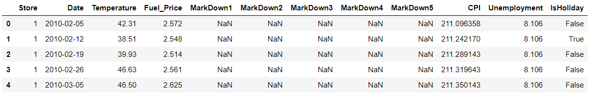
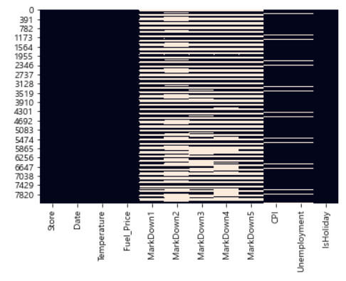
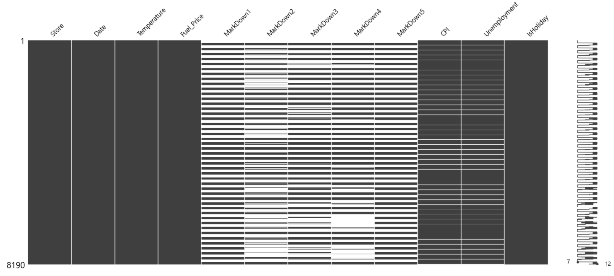
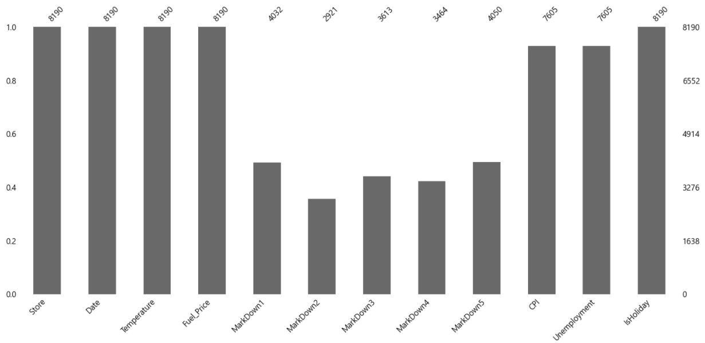

# 결측치 시각화

> 결측치 시각화에 대해서 다룬다.

* ### 사용 데이터

  ```python
  features.head()
  ```

  


## 1. seaborn 사용

* ### libary 호출

  ```python
  import seaborn as sns
  ```

  

* ### heatmap

  ```python
  sns.heatmap(features.isnull(), cmap=False)
  ```

  


## 2. missingo 사용

* ### library 호출

  ```python
  import missingno as msno
  ```


* ### matrix

  ```python
  msno.matrix(features)
  plt.show()
  ```

  * 매트릭스 형태로 결측치를 시각화한다.

  


* ### Bar Chart

  ```python
  msno.bar(features)
  plt.show()
  ```

  


#### 참고

https://github.com/ResidentMario/missingno

