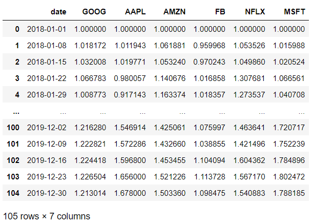
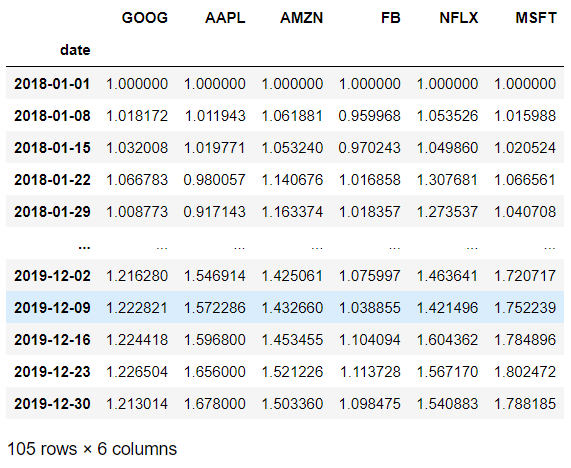
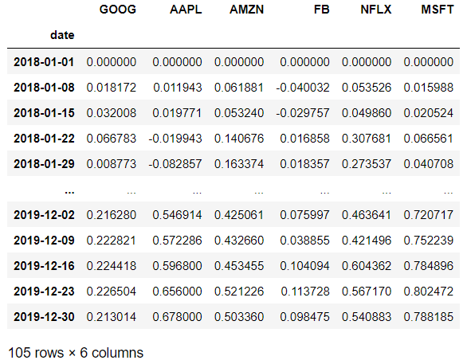
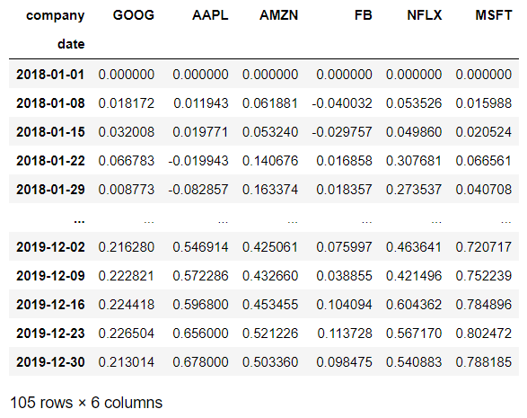
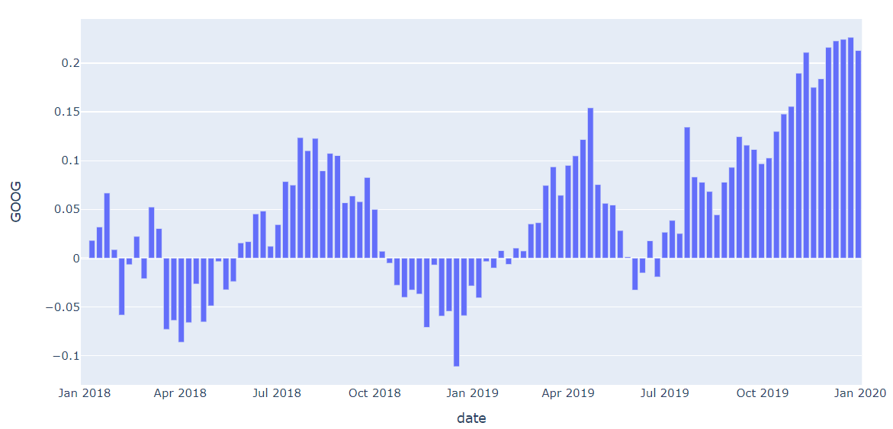
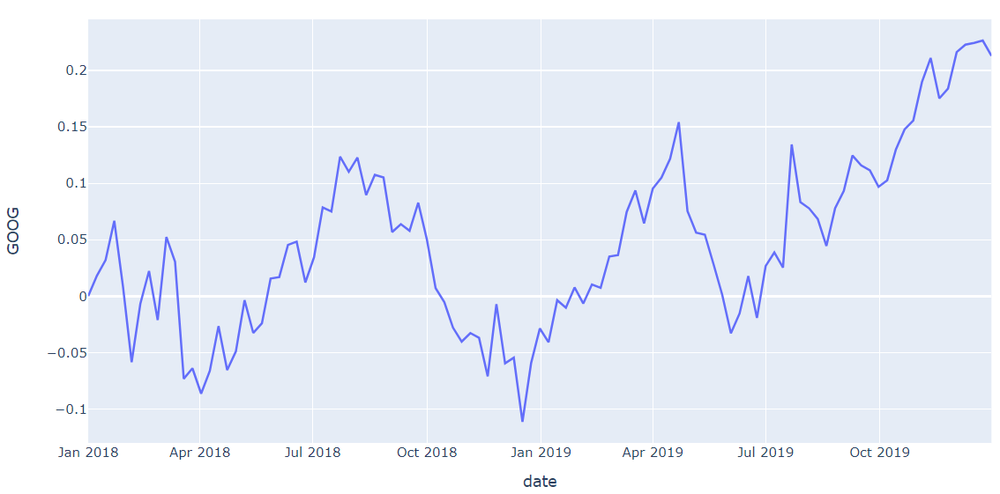
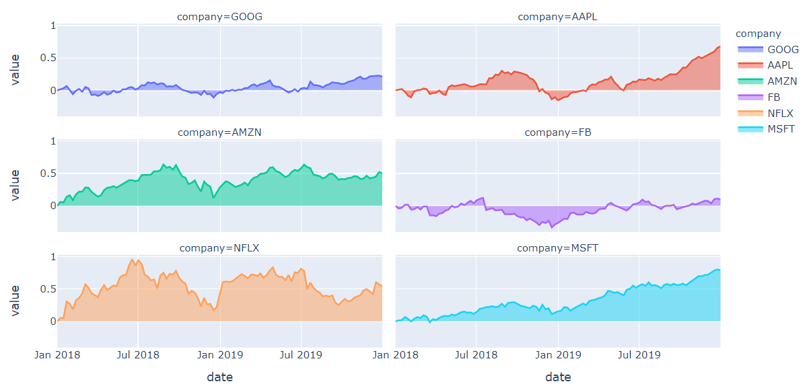
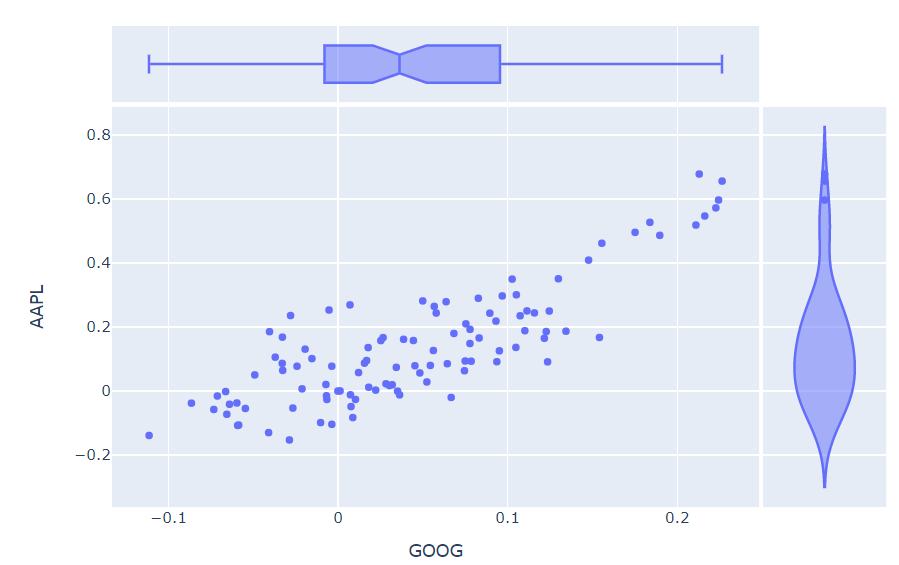
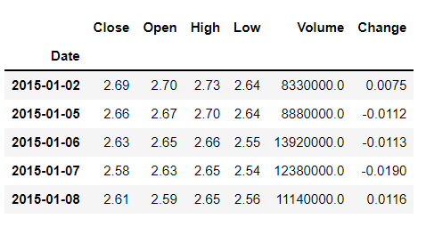
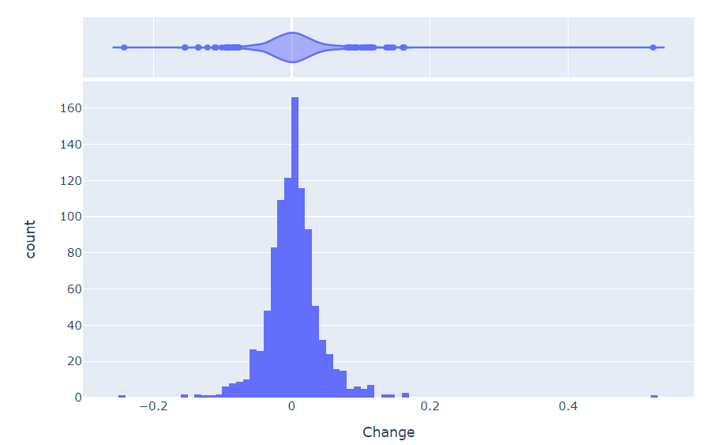

# plotly

> 데이터 시각화의 high-level interface 로 파이썬의 대표적인 interactive 시각화 도구이다.


* ### 내장 데이터 가져오기

  ```python
  import plotly.express as px
  df = px.data.stocks()
  df
  ```

  

  * FAANG + MSFT 주식 데이터이다.

  

* ### 데이터 전처리

  * 날짜 컬럼 → index

    ```python
    df.set_index('date', inplace=True)
    df
    ```

    

  * 전체 data에 -1 연산

    ```python
    df_1 = df - 1
    df_1
    ```

    

  * column명 company로 설정

    ```python
    df_1.columns.name = 'company'
    df_1
    ```

    

* bar plot

  * 구글 수익률 그래프

    ```python
    px.bar(df_1, x=df_1.columns, y='GOOG')
    ```

    

* line plot

  * 구글 수익률 그래프

    ```python
    px.line(df_1, x=df_1.index, y='GOOG')
    ```

    

* area plot

  * 모든종목 subplot으로 표현하기

    ```python
    px.area(df_1, facet_col='company', facet_col_wrap=2)
    ```

    

* scatter plot

  * 구글, 애플 수익 관계

    ```python
    px.scatter(df_1, x='GOOG', y='AAPL', marginal_x='box', marginal_y='violin')
    ```

    

*  ### FinanceDataReader 데이터 로드하기

  ```python
  import FinanceDataReader as fdr
  amd = fdr.DataReader('AMD', '2015', '2021')
  amd.head()
  ```

  

* histogram plot

  ```python
  px.histogram(amd, x='Change', marginal='violin')
  ```

  

